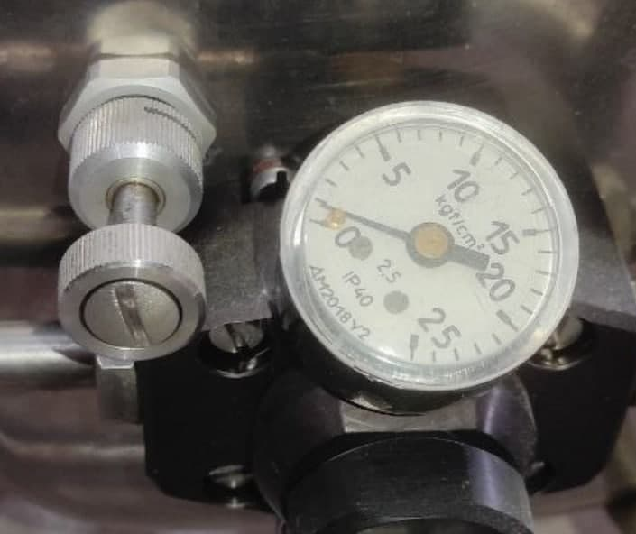

Welcome to Lumache's documentation!
===================================

Первый абзцац
 Текст с отсутпом
  Текст с двумя отступами
Абзац2

Абзац 3

   Вид вентиля дежурной горелки и манометра.

   The legend consists of all elements after the caption.  In this
   case, the legend consists of this paragraph and the following
   table:
   +-----------------------+-----------------------+
   | Symbol                | Meaning               |
   +=======================+=======================+
   | Х                     | Campground            |
   +-----------------------+-----------------------+
   | Z                     | Lake                  |
   +-----------------------+-----------------------+
   | V                     | Mountain              |
   +-----------------------+-----------------------+

В разделе :doc:`usage` более подробная информация, включая :ref:`installation`.

.. note::
   Текст примечания оформленный

1. .. rubric:: **Служебная информация**
      :name: служебная-информация

   1. .. rubric:: **Перечень эксплуатационной документации**
         :name: перечень-эксплуатационной-документации

..

   Полный перечень эксплуатационной документации на аэростат, которой
   следует руководствоваться владельцу (эксплуатанту) ― приведен в
   формуляре аэростата.
   
   
   Хочется сделать тут разрыв страницы
.. raw:: latex

    \clearpage
    
Новая страница после разрыва страницы.
    

**Назначение Руководства**
--------------------------

   Настоящее Руководство по летной эксплуатации (далее Руководство)
   является основным техническим документом, определяющим и
   регламентирующим правила летной эксплуатации аэростата, технику и
   методику выполнения полета с учетом особенностей его конструкции.

   Руководство должно находиться в гондоле аэростата в каждом полете.

**Обязанности держателя Руководства**
-------------------------------------

   Держателем настоящего Руководства является владелец (эксплуатант)
   аэростата.

   Требования и указания настоящего Руководства обязательны для его
   держателя.

   Кроме требований эксплуатационной документации, в том числе
   настоящего Руководства, владелец (эксплуатант) аэростата обязан
   выполнять требования федеральных (национальных) авиационных правил.

   Держатель Руководства несет ответственность за своевременное и
   правильное внесение всех изменений и дополнений.

   Держатель Руководства допускает к полету лиц, имеющих действующее
   свидетельство пилота свободного аэростата, изучивших настоящее
   Руководство и документы, на которые данное Руководство ссылается.

**Термины и определения**
-------------------------

В данном Руководстве приняты следующие термины и определения.

   "Свободный аэростат" - аэростат, у которого отсутствует какая-либо
   связь с земной поверхностью или транспортным средством;

   «Тепловой аэростат» - аэростат, подъемная сила которого создается за
   счет нагретого воздуха.

   «Взлетная масса аэростата» – масса всех составных частей аэростата
   участвующих в полете (масса незагруженного аэростата), топлива в
   баллонах, полезного груза, членов экипажа и пассажиров на момент
   взлета аэростата, без учета массы воздуха, находящегося в оболочке.

   «Предельная взлетная масса аэростата» – взлетная масса аэростата,
   значение которой не может быть превышено ни при каких условиях.
   Предельная взлетная масса определяется конструкцией аэростата.

   «Максимальная взлетная масса аэростата» - взлетная масса аэростата,
   значение которой не может быть превышено при заданных условиях
   полета. Максимальная взлетная масса аэростата определяется внешними
   условиями.

   «Эксплуатант» – любое лицо, осуществляющее эксплуатацию аэростата.

   «Пассажир» – любой человек, кроме пилота, находящийся в гондоле
   собранного аэростата.

   «Оболочка» – конструкция, предназначенная для удержания теплого
   воздуха, который создает подъемную силу.

   «Клин» – ткань, принадлежащая оболочке, ограниченная швами.

   «Полотнище» – часть оболочки между двумя вертикальными швами;
   полотнище состоит из клиньев.

   «Гондола» – конструкция, предназначенная для размещения лиц, грузов и
   оборудования, находящихся на борту аэростата.

   «Блок горелок» – часть топливной системы, предназначенная для
   подготовки топлива к сгоранию и обеспечения контролируемого его
   сжигания для нагрева воздуха в оболочке теплового аэростата;

   «Баллон» – часть топливной системы, топливный бак, в котором
   находится топливо под давлением.

   «Коллектор», «коллекторный рукав» – конструкция, позволяющая
   подсоединить два и более баллонов к блоку горелок.

   «Составная часть» - часть аэростата, в виде готового изделия
   предназначенного для выполнения определенных технических функций в
   составе аэростата. Составными частями аэростата являются: оболочка,
   гондола, блок горелок, баллон и другие части аэростата, упомянутые в
   настоящем руководстве и подпадающие под общее определение составной
   части. В нормативных документах вместо термина «составная часть»
   иногда применяются термины «Компонент» и «Комплектующее изделие».

   «Основная составная часть» – составная часть без которой аэростат не
   может эксплуатироваться.

   «Дополнительная составная часть» - вторая и последующие составные
   части, введенные в состав аэростата в качестве альтернативных
   основной составной части с учетом ограничений и условий данного
   Руководства.

   Номерная (не номерная) составная часть – составная часть имеющая (не
   имеющая) заводской номер.

   «Федеральные (национальные) авиационные правила» – любой
   нормативно-правовой акт, действующий в государстве регистрации или
   эксплуатации аэростата, устанавливающий технические, организационные
   требования или регулирующий правоотношения в области авиации.

**Формы повышения внимания к указаниям Руководства**
----------------------------------------------------

   Для выделения в тексте Руководства указаний или их частей, требующих
   повышенного внимания, используют следующие формы повышения внимания:

-  форма «ПРЕДУПРЕЖДЕНИЕ»;

-  форма «ВНИМАНИЕ»;

-  форма выделенного шрифта внутри текста.

..

   ПРЕДУПРЕЖДЕНИЕ. ИСПОЛЬЗУЕТСЯ ДЛЯ УКАЗАНИЙ В СЛУЧАЯХ, КОГДА
   НЕВЫПОЛНЕНИЕ ПРЕДПИСАННЫХ ДЕЙСТВИЙ ИЛИ НЕПРАВИЛЬНЫЕ ДЕЙСТВИЯ МОГУТ
   ПРИВЕСТИ К НЕПОСРЕДСТВЕННОЙ УГРОЗЕ БЕЗОПАСНОСТИ, В ТОМ ЧИСЛЕ УГРОЗЕ
   ЗДОРОВЬЮ И ЖИЗНИ. ТЕКСТ ПРЕДУПРЕЖДЕНИЯ ПЕЧАТАЕТСЯ ПРОПИСНЫМИ БУКВАМИ
   В РАМКЕ

Горизонтальная линия ниже

------------

И она же выше

   ВНИМАНИЕ. ИСПОЛЬЗУЕТСЯ В СЛУЧАЯХ, КОГДА НЕВЫПОЛНЕНИЕ ПРЕДПИСАННЫХ
   ДЕЙСТВИЙ ИЛИ НЕПРАВИЛЬНЫЕ ДЕЙСТВИЯ МОГУТ ПРИВЕСТИ К НЕЖЕЛАТЕЛЬНЫМ
   ПОСЛЕДСТВИЯМ, К ВОЗНИКНОВЕНИЮ НЕИСПРАВНОСТЕЙ ИЛИ К УМЕНЬШЕНИЮ
   НАДЕЖНОСТИ РАБОТЫ ОТДЕЛЬНЫХ СИСТЕМ И ОБОРУДОВАНИЯ. ТЕКСТ ПЕЧАТАЕТСЯ
   ПРОПИСНЫМИ БУКВАМИ.

   Выделение шрифта внутри текста используется для выделения ОСОБО
   ВАЖНЫХ ГРУПП СЛОВ ИЛИ ОТДЕЛЬНЫХ СЛОВ, определяющих смысл приведенных
   указаний.
   
pythons style guide

#####
PARTS
#####
# with overline, for parts

********
CHAPTERS
********
* with overline, for chapters

SECTION
=======
= for sections

SUBsection
----------
- for subsections

SUBsubsection
^^^^^^^^^^^^^
^ for subsubsections

PARAGRAPHS
""""""""""
" for paragraphs

.. toctree::
   usage
   api
   rotate
   api2
