Предполетная подготовка
-----------------------

Планирование полета
-------------------

   При расчете времени полета, в качестве ориентировочных значений
   используйте данные, приведенные в Приложении А.

   При планировании полета рекомендуется согласовать с командой подбора:

-  место предполагаемой посадки аэростата, исходя из направления и силы
      ветра, а также времени полета;

-  основные и запасные частоты для радиосвязи;

-  дополнительные средства для связи и действия на случай потери
      радиосвязи;

-  проверить работоспособность средств связи.

   1. .. rubric:: Меры безопасности при подготовке к полету
         :name: меры-безопасности-при-подготовке-к-полету

..

   Ответственным за проведение предполетной подготовки является пилот
   аэростата.

   ПРЕДУПРЕЖДЕНИЕ. ЗАПРЕЩАЕТСЯ НАПОЛНЕНИЕ ОБОЛОЧКИ АЭРОСТАТА И ПОЛЕТ В
   УСЛОВИЯХ ТЕРМИЧЕСКОЙ АКТИВНОСТИ, ВБЛИЗИ КУЧЕВОЙ и КУЧЕВО-ДОЖДЕВОЙ
   ОБЛАЧНОСТИ.

   ВНИМАНИЕ. ЗАПРЕЩАЕТСЯ ЭКСПЛУАТИРОВАТЬ АЭРОСТАТ ИМЕЮЩИЙ ПОВРЕЖДЕНИЯ И
   ДЕФЕКТЫ, ЗА ИСКЛЮЧЕНИЕМ ДОПУСТИМЫХ, КОТОРЫЕ ПЕРЕЧИСЛЕНЫ В РАЗДЕЛЕ 9
   НАСТОЯЩЕГО РУКОВОДСТВА ИЛИ С ИСТЕКШИМ СРОКОМ ОЧЕРЕДНОЙ ПРОВЕРКИ
   ТЕХНИЧЕСКОГО СОСТОЯНИЯ, ВКЛЮЧАЯ СОСТАВНЫЕ ЧАСТИ.

   ПРЕДУПРЕЖДЕНИЕ. ЗАПРЕЩАЕТСЯ ПРИ НАПОЛНЕНИИ АЭРОСТАТА ВОЗДУХОМ
   НАКРУЧИВАТЬ НА РУКУ ИЛИ ВОКРУГ ТЕЛА ФАЛЫ И ТРОСЫ, ЗАКРЕПЛЕННЫЕ К
   АЭРОСТАТУ. ДЕРЖАТЬ ИХ НЕОБХОДИМО ТОЛЬКО ЗАХВАТОМ РУКИ. НА РУКАХ
   ДОЛЖНЫ БЫТЬ НАДЕТЫ ПЕРЧАТКИ ИЛИ РУКАВИЦЫ.

   ПРЕДУПРЕЖДЕНИЕ. ЗАПРЕЩАЕТСЯ НАХОДИТЬСЯ БЕЗ НЕОБХОДИМОСТИ В
   НЕПОСРЕДСТВЕННОЙ БЛИЗОСТИ ОТ ФАЛОВ, КОТОРЫМИ ЗАКРЕПЛЕН АЭРОСТАТ.

   | ВНИМАНИЕ. УБЕДИТЕСЬ В УСТОЙЧИВОМ ПОЛОЖЕНИИ ВЕНТИЛЯТОРА, ЕСЛИ ЕГО НЕ
     БУДЕТ УДЕРЖИВАТЬ ЧЛЕН КОМАНДЫ.
   | ВНИМАНИЕ. ЗАПРЕЩАЕТСЯ ЭКСПЛУАТАЦИЯ ВЕНТИЛЯТОРА С ПОВРЕЖДЕННЫМ
     ВИНТОМ И/ИЛИ ПОВРЕЖДЕННЫМ ОГРАЖДЕНИЕМ ВИНТА.

   При ухудшении погодных условия (см.п.2.3) прекратите все действия,
   связанные с подъемом аэростата.

   Должна быть полная уверенность, что в месте планируемой посадки
   погодные условия удовлетворительные и соответствуют требованиям п.
   2.3.

   Резкое отличие погодных условий в месте старта и месте посадки может
   наблюдаться в горной и холмистой местностях, а также при старте в
   утренние часы, когда за время полета повышается термическая
   активность атмосферы.

Ограничение максимальной взлетной массы
---------------------------------------

   Пилот до взлета должен произвести расчет взлетной массы аэростата и
   сравнить ее с максимальной (Приложение А). Взлетная масса
   складывается из:

-  массы конструкции каждой составной части аэростата, необходимой для
      обеспечения полета;

-  массы газа, заправленного в баллоны;

-  массы пассажиров и пилота, включая одежду;

-  массы других предметов, находящихся на борту и на оболочке аэростата.

..

   ВНИМАНИЕ. ВЗЛЕТНАЯ МАССА АЭРОСТАТА НЕ ДОЛЖНА ПРЕВЫШАТЬ МАКСИМАЛЬНУЮ
   ВЗЛЕТНУЮ МАССУ.

   Масса каждой составной части аэростата указана в формуляре аэростата.

   Масса газа заправленного в баллоны в килограммах принимается равной
   0,5*Q, где Q – объем заправленного газа в литрах.

   Масса пассажиров определяется путем опроса. В зимнее время
   декларируемую ими массу необходимо увеличить на 5-7%.

   Масса оборудования, приборов и вещей кроме одежды при массе одной
   единицы менее 10 кг определяется экспертным путем. В противном
   случае - путем взвешивания.

   Пример. Для аэростата, укомплектованного оболочкой объемом 2950
   м\ :sup:`3`: если место старта находится на высоте 750 м над уровнем
   моря, а максимальная высота на протяжении всего полета запланирована
   2000 м над уровнем моря, то при температуре воздуха на месте старта
   +15˚С, взлетная масса аэростата не должна превышать 738 кг.

Экипировка пилота и пассажиров
------------------------------

   ВНИМАНИЕ. ОДЕЖДА ПИЛОТА АЭРОСТАТА И, ЖЕЛАТЕЛЬНО, ПАССАЖИРОВ ДОЛЖНА
   БЫТЬ ВЫПОЛНЕНА ИЗ НЕОПЛАВЛЯЕМОЙ ТКАНИ И НЕ ИМЕТЬ СВОБОДНЫХ КОНЦОВ,
   способных зацепиться за элементы конструкции аэростата или попасть в
   работающий вентилятор.

   ВНИМАНИЕ. ПИЛОТ АЭРОСТАТА ДОЛЖЕН БЫТЬ В ПЛОТНЫХ ПЕРЧАТКАХ ИЛИ
   РУКАВИЦАХ ИЗ НЕОПЛАВЛЯЕМОГО МАТЕРИАЛА. Пассажирам рекомендуется быть
   в головных уборах, обувь - без высоких каблуков.

   При полетах вблизи больших водных пространств в гондоле должны
   находиться индивидуальные спасательные жилеты на каждого пассажира и
   пилота.

Требования к месту старта
-------------------------

   Площадка для старта аэростата предпочтительно должна представлять
   собой ровную поверхность без предметов, способных повредить аэростат.
   Наиболее подходящей площадкой является травяной газон. Не
   рекомендуются каменистые площадки и площадки со стерней, например,
   после уборки пшеницы или кукурузы. На ней не должно быть ничего
   способного повредить или испачкать оболочку. Площадка, выбранная для
   старта аэростата, должна быть с наветренной стороны свободного
   пространства и, если возможно, защищена от ветра.

   ПРЕДУПРЕЖДЕНИЕ. ТРАЕКТОРИЯ ПРЕДПОЛАГАЕМОГО ВЗЛЕТА ДОЛЖНА БЫТЬ
   СВОБОДНОЙ ОТ ЛИНИЙ ЭЛЕКТРОПЕРЕДАЧ И ВЫСОКИХ СТРОЕНИЙ НА ДОСТАТОЧНОМ
   РАССТОЯНИИ. НЕ ДОЛЖНО БЫТЬ БЛИЗКО ПРЕПЯТСТВИЙ ПО ОБЕ СТОРОНЫ ОТ ЛИНИИ
   ВЗЛЕТА АЭРОСТАТА.

   Размеры площадки зависят от погодных и других условий. Не должно быть
   линий электропередач, строений или иных препятствий по обе стороны от
   планируемой траектории взлета. Место старта аэростата должно быть
   удалено от высоких строений и препятствий в зависимости от скорости
   ветра, но не менее чем на 200…300 м от линий электропередач,
   промышленных или других опасных объектов.

+--------------------+-----------------------+-------------------------+
| Расстояние от      |                       |                         |
| места старта до    |                       |                         |
| высоких строений   |                       |                         |
| (где h – высота    |                       |                         |
| препятствий)       |                       |                         |
+====================+=======================+=========================+
| Скорость ветра м/с |    Расстояние (м)     |                         |
+--------------------+-----------------------+-------------------------+
|                    | По линии маршрута     |    В сторону от линии   |
+--------------------+-----------------------+-------------------------+
|    0...2           |    4h                 |    1h                   |
+--------------------+-----------------------+-------------------------+
|    2...5           |    10h                |    2h                   |
+--------------------+-----------------------+-------------------------+
|    6...7           |    15h                |    3h                   |
+--------------------+-----------------------+-------------------------+

..

   При подъемах на привязи площадку подберите таким образом, чтобы при
   натяжении привязного фала (фалов) в любом направлении от точки
   закрепления, препятствий, с учетом возможного отклонения оболочки от
   вертикальной оси.

3. .. rubric:: Подготовка к полету и сборка аэростата
      :name: подготовка-к-полету-и-сборка-аэростата

   1. .. rubric:: Общие положения
         :name: общие-положения

..

   Подготовка к полету и сборка аэростата является важной операцией
   определяющей летную годность и относится к оперативному техническому
   обслуживанию.

   В процессе подготовки проведите осмотр и проверку аэростата на
   предмет отсутствия повреждений и дефектов, выходящих за пределы
   указанные в разделе 9 «Допустимые повреждения и дефекты».

   Если в процессе подготовки к полету и сборки аэростата выявляются
   дефекты, выходящие за пределы указанные разделе 9, аэростат к полету
   не допускается.

   Убедитесь в наличии на борту исправных приборов и оборудования с
   действующими сроками эксплуатации, указанными в разделе 2.12.

   Убедитесь, что расчет взлетной массы произведен (см. раздел 4.3).

Сборка и подготовка гондолы, блока горелок, баллонов
~~~~~~~~~~~~~~~~~~~~~~~~~~~~~~~~~~~~~~~~~~~~~~~~~~~~

   Поместите гондолу в месте старта на площадке, выбранной в
   соответствии с требованиями, изложенными выше.

   При перемещении гондолы по грунту рекомендуется тянуть, как минимум,
   за две симметрично расположенные ручки для равномерного распределения
   нагрузки, чтобы избежать повреждения мест их крепления.

   Отверстие-ступень гондолы должно быть с наветренной стороны.

   Вставьте стойки в гнезда гондолы (Рисунок 4.1.), установите блок
   горелок на стойки гондолы. Закрепите карабинами раму блока горелок с
   тросами гондолы, коуши тросов при этом располагать так, чтобы
   кронштейн оказался между ними.

   ВНИМАНИЕ. ПЕРЕХЛЕСТ ТРОСОВ НЕ ДОПУСКАЕТСЯ.

+-----------------------------------------------------------------------+
|                                                                       |
+-----------------------------------------------------------------------+

..

   |image2|\ |image3|

   Рисунок 4.1. Установка стоек и горелки.

   Наденьте декоративные чехлы на стойки гондолы, при этом рукава блока
   горелок и тросы гондолы должны находиться внутри чехлов.

   ВНИМАНИЕ. ПРОВЕРЬТЕ ЗАПРАВКУ ГАЗОВЫХ БАЛЛОНОВ ПУТЕМ ОТКРЫТИЯ НИППЕЛЯ.
   При легком покачивании баллона из отверстия ниппеля должен выходить
   жидкий газ. Если этого не происходит, значит баллон не полный и его
   необходимо дозаправить.

   Установите баллоны в гондоле. Присоедините топливные баллоны к
   стенкам корзины ремнями, проходящими через проушины в стенке корзины,
   и хорошо затяните.

   4.6.2.1. Снимите технологические заглушки с баллонов. Проверьте
   герметичность нажимного клапана; для этого откройте вентиль, газ не
   должен выходить из штуцера баллона. По окончании проверки закройте
   вентили. Смажьте тонким слоем смазкой ЦИАТИМ-201 ГОСТ 6267-74 или
   жидкой силиконовой смазкой резиновые уплотнительные кольца на
   штуцерах баллонов.

   4.6.2.2. Снимите технологические заглушки с рукавов блока горелок и
   тщательно осмотрите состояние поверхностей и резиновых уплотнений
   стыковочных элементов баллонов, блока горелок и коллектора при его
   наличии. Ответные металлические поверхности не должны иметь рисок,
   задиров. Все внутренние поверхности должны быть чистыми, без песка и
   грязи.

   Подсоедините рукава блока горелок к соответствующим баллонам.

   4.6.2.3. При наличии коллектора (коллекторов) закрепите его в гондоле
   с помощью пластиковых электротехнических хомутов, как можно ближе к
   верхнему поручню гондолы (Рисунок 4.3). Подсоедините накидную гайку
   рукава горелки 3 к разъему тройника 2 коллектора. Накидные гайки
   коллектора 4 подсоедините к баллонам.

   ВНИМАНИЕ. В ПРОЦЕССЕ ПОДСОЕДИНЕНИЯ СЛЕДИТЕ, ЧТОБЫ ШЛАНГИ НЕ
   ПРОВОРАЧИВАЛИСЬ ВМЕСТЕ С НАКИДНЫМИ ГАЙКАМИ.

   При общем количестве в гондоле 4-х баллонов объединенных коллекторами
   по два баллона в две группы **запрещается** открывать оба баллона
   одной группы одновременно, в этом случае переход на второй баллон
   после выработки топлива осуществляется закрытием вентиля первого
   баллона и открытием вентиля второго.

+-----------------------------------------------------------------------+
| |4 Крепление коллектора|                                              |
+=======================================================================+
| 1 - рукав горелки; 2 - тройник коллектора (опциональный компонент); 3 |
| - накидная гайка рукава горелки; 4 - накидная гайка рукава            |
| коллектора.                                                           |
|                                                                       |
| Рисунок 4.3. Крепление коллектора в гондоле                           |
+-----------------------------------------------------------------------+

..

   Резьбовые соединения рукавов должны подсоединяться без применения
   какого-либо инструмента.

   4.6.2.4. ВНИМАНИЕ. УБЕДИТЕСЬ НА СЛУХ И ПО ЗАПАХУ В ГЕРМЕТИЧНОСТИ
   СОЕДИНЕНИЙ, ПРИ ЗАКРЫТЫХ КЛАПАНАХ БЛОКА ГОРЕЛОК И ОТКРЫТЫХ ВЕНТИЛЯХ
   НА БАЛЛОНАХ, К КОТОРЫМ ПОДСОЕДИНЕНЫ РУКАВА.

   ТЕЧИ НЕ ДОПУСКАЮТСЯ.

   4.6.2.5. В процессе проверки герметичности внимательно осмотрите
   рукава блока горелок, а также коллектора при его наличии. Вздутия,
   разрывы наружного слоя и трещины не допускаются.

   4.6.2.6. Убедитесь, что блок горелок свободно отклоняется на
   достаточные для работы углы. Если рукава блока горелок не позволяют
   ему свободно отклоняться на достаточные для работы углы, то вытяните
   часть рукавов, выходящих из чехлов стоек.

   4.6.2.7. ВНИМАНИЕ. ПРОВЕРЬТЕ РАБОТОСПОСОБНОСТЬ БЛОКА ГОРЕЛОК ОТ ВСЕХ
   БАЛЛОНОВ, которые будут использованы в полете, для этого:

-  при закрытом огневом клапане откройте вентили подключенных баллонов,
      проверьте давление по манометрам, которое должно быть в пределах
      ограничений раздела 2.9;

-  откройте клапан одной дежурной горелки и зажгите дежурную горелку;

-  проконтролируйте высоту пламени дежурной горелки, которая должна
      находиться в районе верхнего витка испарителя горелки, это условие
      особенно важно при планировании полетов на высоты более 2000м;

-  повторите операцию на второй дежурной горелке;

-  в зимнее время при температуре менее -5\ :sup:`о`\ С дайте
      возможность прогрева испарителя горелки от дежурной горелки в
      течение 2…3 минут (данная процедура поможет избежать попадания в
      гондолу жидкого несгоревшего газа);

-  откройте полностью огневой клапан сначала на одной из горелок на
      3-4 секунды, затем на другой, при этом обратите внимание, чтобы
      газ равномерно выходил из всех форсунок, и пламя было стабильно в
      течение всего цикла работы каждой горелки;

-  закройте вентили баллонов, выжгите оставшийся в рукавах газ и
      выключите дежурные горелки.

..

   Аналогичным образом проверьте все баллоны, которые будут использованы
   в полете по пунктам 4.6.2.1.- 4.6.2.7.

   4.6.2.8. Закрепите приборный блок на одной из стоек, находящейся с
   подветренной стороны.

   4.6.2.9. Убедитесь в том, что кроме приборного блока на борту
   находится следующее обязательное оборудование:

   - огнетушитель;

   - медицинская аптечка;

   - запасная зажигалка или спички.

4.6.3. Подготовка и наполнение оболочки
**Поместите оболочку в чехле примерно в 5**-**9 метрах по ветру от гондолы (Рисунок 4.4).** 
~~~~~~~~~~~~~~~~~~~~~~~~~~~~~~~~~~~~~~~~~~~~~~~~~~~~~~~~~~~~~~~~~~~~~~~~~~~~~~~~~~~~~~~~~~~

+-----------------------------------------------------------------------+
| |4 Подготовка 1|                                                      |
+=======================================================================+
+-----------------------------------------------------------------------+

..

   Рисунок 4.4. Расположение гондолы и оболочки при подготовке к полету

   Вытащите воздухозаборник и нижнюю часть оболочки (юбку) из сумки. На
   юбке найдите маркировку мест крепления тросов «1» и «12» и
   идентификационную бирку аэростата (Рисунок 1.1). Сориентируйте сумку
   с оболочкой таким образом, чтобы бирка и номера «1» и «12» оказались
   сверху разложенной оболочки, убедитесь, что ткань оболочки не
   перекручена. Вытащите из сумки часть оболочки и

   Положите гондолу набок, так, чтобы отверстие-ступенька находилась
   сверху, а горелка была направлена по ветру.

   Прикрепите карабины тросов оболочки, не допуская их перехлестов, к
   карабинам, которые соединяют горелку с тросами гондолы (Рисунок 4.5).
   Каждая группа тросов оболочки должна соединяться с соответствующим
   местом крепления на раме блока горелок. После закрепления заверните
   резьбовые муфты карабинов до упора, затем отпустите их на четверть
   оборота назад.

+-----------------------------------------------------------------------+
| |image4|                                                              |
+=======================================================================+
+-----------------------------------------------------------------------+

..

   1 - тросы оболочки; 2 - карабин оболочки; 3 - карабин гондолы; 4 -
   рама блока горелок; 5 - тросы гондолы; 6 – стойка гондолы; 7 – стакан
   рамы блока горелок

   Рисунок 4.5. Крепление оболочки к гондоле.

   Вытаскивая ткань оболочки, отходите с сумкой от гондолы по ветру,
   пока вся оболочка не будет вытянута из сумки. Расправьте оболочку по
   всей длине, начиная от места крепления тросов к гондоле и заканчивая
   выпускным отверстием, растягивая ткань оболочки в стороны за ленты №
   9 и № 4.

   ВНИМАНИЕ. ВО ИЗБЕЖАНИЕ ПРЕЖДЕВРЕМЕННОГО СТАРЕНИЯ ОБОЛОЧКИ НЕ
   ОСТАВЛЯЙТЕ ЕЕ РАЗВЕРНУТОЙ ПОД ДЕЙСТВИЕМ ПРЯМЫХ СОЛНЕЧНЫХ ЛУЧЕЙ.

   Присоедините концы всех фалов оболочки, спускающихся в гондолу, к
   карабинам гондолы или оболочки.

   В процессе раскладки оболочки:

-  проверьте состояние поверхности полюсного кольца оболочки: забоин,
      заусенцев, трещин не должно быть. При дефекте, глубиной менее 1
      мм, его необходимо устранить напильником и место зачистки
      зашлифовать;

-  проверьте состояние и надежность заделки вертикальных силовых лент на
      полюсном кольце. НЕ ДОПУСКАЮТСЯ РАЗРЫВЫ, РАЗЛОХМАЧИВАНИЕ И ДРУГИЕ
      ПОВРЕЖДЕНИЯ ЛЕНТ;

-  осмотрите СТАЛЬНЫЕ ТРОСЫ, ОНИ НЕ ДОЛЖНЫ ИМЕТЬ РАЗРЫВОВ ЖИЛ, изломов,
      ЗАДЕЛКА КОНЦОВ НЕ ДОЛЖНА ИМЕТЬ ВИДИМЫХ ПОВРЕЖДЕНИЙ;

-  осмотрите состояние ткани и силовых лент оболочки, ПОВРЕЖДЕНИЯ ЛЕНТ
      НЕ ДОПУСКАЮТСЯ. ТКАНЬ, ВЫШЕ ПЕРВОЙ ГОРИЗОНТАЛЬНОЙ ЛЕНТЫ, НЕ ДОЛЖНА
      ИМЕТЬ РАЗРЫВОВ ИЛИ ДРУГИХ ПОВРЕЖДЕНИЙ.

..

   Перед началом наполнения оболочки холодным воздухом рекомендуется
   закрепить аэростат в соответствии с разделом 4.6.3. ПРИ ВЕТРЕ БОЛЕЕ 2
   М/С ИЛИ ПРИ СТАРТЕ НА ПОЛЕ, ГДЕ РАЗМЕЩАЮТСЯ ДРУГИЕ АЭРОСТАТЫ ИЛИ
   ПУБЛИКА, ПИЛОТ ОБЯЗАН ЗАКРЕПИТЬ АЭРОСТАТ в соответствии с разделом
   4.6.4 ДО НАЧАЛА НАПОЛНЕНИЯ ОБОЛОЧКИ ХОЛОДНЫМ ВОЗДУХОМ.

   При наддуве и наполнении оболочки холодным воздухом (Рисунок 4.6)
   необходима особая слаженность в работе команды. Рекомендуемое
   количество человек и их расстановка следующая:

-  1 человек – координация действий, осмотр оболочки, работа с блоком
      горелок – как правило, это выполняет пилот аэростата;

-  1 человек – удержание фала купола;

-  2 человека – удержание входного отверстия для холодного наполнения;

-  1 человек – обслуживание вентилятора, помощь в удержании входного
      отверстия.

+-----------------------------------------------------------------------+
| |4 Подготовка 3а|                                                     |
+=======================================================================+
+-----------------------------------------------------------------------+

..

   Рисунок 4.5. Наполнение оболочки холодным воздухом

   Раскройте входное отверстие аэростата, растягивая ткань юбки за
   тросы, идущие к корзине; держаться за ткань юбки не рекомендуется во
   избежание ее разрыва. Рекомендуется воздухозаборник заправить под
   юбку, однако при наличии сухой травы во избежание ее возгорания,
   карабины воздухозаборника необходимо сразу закрепить за карабины
   гондолы.

   Чтобы часть ткани, находящаяся на земле, не поднималась потоком
   воздуха от вентилятора, наступите ногой на средний трос нижней
   группы, при этом следите, чтобы вы не оказались между тросами или
   трос не проходил между ног.

   Запустите вентилятор и установите средние обороты. В процессе
   наполнения обойдите оболочку и осмотрите ткань и силовые ленты на
   предмет отсутствия повреждений оболочки, убедитесь в правильности
   действий обслуживающего персонала.

   ВНИМАНИЕ. В НЕПОСРЕДСТВЕННОЙ БЛИЗОСТИ ОТ РАБОТАЮЩЕГО ВЕНТИЛЯТОРА НЕ
   ДОЛЖНЫ НАХОДИТЬСЯ ЛИЦА, НЕ ПРОИНСТРУКТИРОВАННЫЕ И НЕ УЧАСТВУЮЩИЕ В
   ПОДГОТОВКЕ К ПОЛЕТУ. В ПЛОСКОСТИ ВРАЩЕНИЯ ВИНТА ВЕНТИЛЯТОРА НЕ ДОЛЖНЫ
   НАХОДИТЬСЯ ЛЮБЫЕ ЛИЦА.

   Закрепите парашютный клапан по периметру выпускного отверстия с
   помощью нашитых на оболочке текстильных застежек (липучек). Ленты
   вертикального каркаса не должны быть запутаны. Номера на парашютном
   клапане должны совпадать с номерами на крае выпускного отверстия
   оболочки.

   Растяните ткань оболочки так, чтобы на той части, которая лежит на
   земле, было как можно меньше складок.

   Установите на вентиляторе максимальные обороты. Добейтесь
   максимального наполнения оболочки холодным воздухом. Неполное
   наполнение может привести к схлопыванию входного отверстия (юбки) при
   подъеме оболочки.

+-----------------------------------------------------------------------+
| |4 Подготовка 3|                                                      |
+=======================================================================+
+-----------------------------------------------------------------------+

..

   Рисунок 4.6. Положение гондолы и вентилятора в процессе холодного
   наполнения

   Убедитесь, что тросы и фалы не попадут в пламя горелки, что концы
   всех фалов оболочки, спускающихся в гондолу не перепутаны. Откройте
   вентили на баллонах, которые подсоединены к блоку горелок. Зажгите
   дежурные горелки.

   Подайте сигнал о начале горячего наполнения помощникам. Направьте
   горелку в нижнюю треть отверстия. Открывайте огневой клапан одной из
   горелок и импульсами по 3…4 сек. начинайте нагревать воздух в
   оболочке. Внимательно следите, чтобы пламя не коснулось ткани
   оболочки.

   Член команды, удерживающий фал купола, натягивая его, должен
   исключить преждевременный подъем оболочки до тех пор, пока она не
   наполнится воздухом и будет в состоянии поднять гондолу в
   вертикальное положение.

   Когда оболочка будет уже стремиться подняться, выключите вентилятор
   или подайте команду о его выключении.

   В конце процесса наполнения горловина оболочки имеет тенденцию к
   сжатию; это проявляется тем больше, чем хуже была расправлена
   оболочка и, чем меньше она была наполнена холодным воздухом.

   Когда оболочка начинает поднимать гондолу в вертикальное положение,
   займите место в гондоле и подайте команду, чтобы помощники удерживали
   гондолу от возможного отрыва от земли.

   ВНИМАНИЕ. УДЕРЖИВАТЬ ГОНДОЛУ МОЖНО ТОЛЬКО РУКАМИ. ВСТАВЛЯТЬ НОГИ В
   ОКНО-СТУПЕНЬ ИЛИ ВЕРЕВОЧНЫЕ ПЕТЛИ С ЦЕЛЬЮ УДЕРЖАНИЯ ГОНДОЛЫ
   ЗАПРЕЩАЕТСЯ!

   Присоедините карабин полюсного фала к карабину гондолы. Полюсный фал
   не должен крепиться к месту, за которое закреплены фалы управления.
   Присоедините карабины воздухозаборника к карабинам гондолы.

   Проверьте работоспособность парашютного клапана, для этого потяните
   за фал управления и откройте парашютный клапан так, чтобы текстильные
   застежки (липучки) по всему периметру отошли друг от друга, а клапан
   полностью открылся, после этого сразу закройте его. Обратите внимание
   на центрирующие стропы парашютного клапана, натяжение у всех должно
   быть одинаковым, ткань клапана должна плотно прилегать к краю
   выпускного отверстия оболочки.

   ВНИМАНИЕ. РАЗЪЕДИНЕНИЕ ТЕКСТИЛЬНЫХ ЗАСТЕЖЕК ПАРАШЮТНОГО КЛАПАНА НУЖНО
   ПРОИЗВОДИТЬ ДО ВЗЛЕТА.

   С целью визуального контроля открытия поворотного клапана, потяните
   за один из его фалов (зеленый или черный), убедитесь, что клапан
   открылся, отпустите фал, потяните за другую его часть, убедитесь, что
   открылся другой поворотный клапан.

   При работе фалами управления не должно наблюдаться заедания и рывков.

   Внимательно осмотрите состояние оболочки изнутри через входное
   отверстие. Фалы управления клапанами не должны иметь перехлестов и
   должны проходить через установленные места скольжения.

   ВНИМАНИЕ. ОТСТАВАНИЕ ТКАНИ ПАРАШЮТНОГО КЛАПАНА ОТ КРАЯ ВЫПУСКНОГО
   ОТВЕРСТИЯ, ПРОВИСАНИЕ ОТДЕЛЬНЫХ ЦЕНТРИРУЮЩИХ СТРОП НЕ ДОПУСКАЕТСЯ.

   ВНИМАНИЕ. ЗАПРЕЩАЕТСЯ ЭКСПЛУАТАЦИЯ ОБОЛОЧКИ АЭРОСТАТА В СЛУЧАЕ, ЕСЛИ
   ФАКТИЧЕСКИЙ РАСХОД ПРЕВЫШАЕТ УКАЗАННЫЙ В НАСТОЯЩЕМ РУКОВОДСТВЕ БОЛЕЕ,
   ЧЕМ НА 30% (Приложение А).

   Рекомендации по возможным способам устранения повышенного расхода
   даны в Руководстве по техническому обслуживанию и ремонту.

Крепление аэростата перед взлетом
~~~~~~~~~~~~~~~~~~~~~~~~~~~~~~~~~

   При подготовке к свободному полету при скоростях ветра более 2 м/с, а
   на месте общего старта независимо от скорости ветра, используйте
   механизм отцепки с уздечкой, предназначенный для отсоединения
   аэростата от привязного фала перед взлетом.

   Уздечка подсоединяется к карабинам гондолы и оболочки с наветренной
   стороны. Крепление уздечки можно выполнять двумя способами:
   непосредственно на петли уздечки (а), либо при помощи дополнительных
   карабинов (б), как показано на Рисунке 4.7. В первом случае, в каждую
   петлю уздечки продевается карабин гондолы и карабин оболочки. Во
   втором, каждый дополнительный карабин уздечки должен захватывать
   карабин гондолы и карабин тросов оболочки. В первом случае после
   старта уздечка остается на раме горелки и ее необходимо обмотать
   вокруг рамы, чтобы она не мешала в полете. Во втором случае, уздечка
   после старта отстегивается и убирается в сумку.

   .. image:: media/image21.jpg
      :width: 5.73888in
      :height: 2.17531in

   а) б)

   | а) крепление уздечки непосредственно к карабинам гондолы и оболочки
   | б) крепление уздечки при помощи дополнительных карабинов

   1 – уздечка; 2 – карабины; 3 – замок отцепа; 4 – привязной фал; 5 -
   дополнительный карабин.

   Рисунок 4.7. Крепление уздечки и замка отцепа.

4.6.5. Действия непосредственно перед взлетом
~~~~~~~~~~~~~~~~~~~~~~~~~~~~~~~~~~~~~~~~~~~~~

   Проверьте наличие необходимой на борту документации, предусмотренной
   федеральными (национальными) авиационными правилами, а также приборов
   и оборудования, указанных в разделе 2.12.

   Включите приборный блок, убедитесь, что цикл самотестирования успешно
   завершился. Убедитесь по индикатору прибора в достаточности уровня
   заряда батарей и его работоспособности в соответствии с
   эксплуатационной документацией на приборный блок.

   Распишитесь в «Бортовом журнале» за проведение предполетной
   подготовки.

   Подайте команду пассажирам на занятие мест в гондоле. Посадку и
   высадку пассажиров производить с наветренной стороны.

   Для удобства посадки рекомендуется пользоваться окном-ступенькой.

   Проинструктируйте пассажиров о поведении в полете и при посадке
   аэростата:

-  не держитесь за шланги, тросы и фалы;

-  не трогайте вентили баллонов;

-  при посадке держитесь за внутренние веревочные петли, со стороны,
      противоположной направлению движения, и за ограждения баллонов.

-  при посадке не высовывайте руки из гондолы;

-  внимательно следите за снижением и ожидайте удара, который может быть
      сильным; при наличии ветра возможно волочение гондолы;

-  займите правильное положение при посадке;

-  не покидайте гондолу без команды пилота.

4. .. rubric:: Выполнение полета
      :name: выполнение-полета

   1. .. rubric:: Взлет
         :name: взлет

      1. .. rubric:: Взлет в простых условиях
            :name: взлет-в-простых-условиях

..

   К взлету в простых условиях относятся взлеты в условиях отсутствия
   термической активности атмосферы, с ровных площадок, при скорости
   ветра не более 2м/с.

   Расстояние от места старта до высоких строений указано в разделе 4.5.

   При взлете в простых условиях гондола может удерживаться с целью
   предотвращения преждевременного взлета аэростата членами команды,
   участвующими в подготовке аэростата к полету. Удерживание гондолы
   производить на полусогнутых или вытянутых руках.

   Включите горелку, создайте избыточную подъемную силу, способную
   обеспечить пролет через препятствия, находящиеся на пути следования
   аэростата. При этом температура в оболочке не должна превышать
   предельно допустимого значения.

   Подайте команду, чтобы все лица, удерживающие гондолу, одновременно
   ее отпустили.

Взлет при ветре и с закрытой площадки
~~~~~~~~~~~~~~~~~~~~~~~~~~~~~~~~~~~~~

   При взлете в ветреную погоду (скорость ветра более 2 м/с), независимо
   от того, производится старт с открытой или закрытой площадки,
   аэростат должен быть зачален с помощью стартового фала и механизма
   отцепки в соответствии с подразделом 4.6.2.

   ВНИМАНИЕ. ОБЕСПЕЧЬТЕ СКОРОПОДЪЕМНОСТЬ В МОМЕНТ ОТРЫВА ПРИМЕРНО НЕ
   МЕНЕЕ\ ** ** 2 м/с, что необходимо для преодоления возможной потери
   подъемной силы при выходе аэростата с закрытой площадки.

   Потеря подъемной силы связана с деформацией оболочки при попадании
   аэростата в воздушный поток с большей скоростью по сравнению со
   скоростью ветра в месте старта, а также с исчезновением ложной
   подъемной силы, которая присутствует когда верхняя часть аэростата
   обтекается более быстрым потоком.

   ВНИМАНИЕ: ЕСЛИ В СОСТАВЕ АЭРОСТАТА ОТСУТСТВУЕТ УКАЗАТЕЛЬ ТЕМПЕРАТУРЫ
   В ОБОЛОЧКЕ, ТО ВО ИЗБЕЖАНИЕ ПРЕВЫШЕНИЯ ПРЕДЕЛЬНО ДОПУСТИМОЙ
   ТЕМПЕРАТУРЫ, СКОРОПОДЪЕМНОСТЬ НЕ ДОЛЖНА ПРЕВЫШАТЬ 3м/с.

   При отцепке стартового фала следите, чтобы вблизи него не было людей.

   ВНИМАНИЕ. ПОКА АЭРОСТАТ НЕ НАБРАЛ ВЫСОТУ БОЛЕЕ, ЧЕМ ВЫСОТА СТРОЕНИЙ,
   ДЕРЕВЬЕВ И ДРУГИХ ПРЕПЯТСТВИЙ, ПАССАЖИРЫ ДОЛЖНЫ ДЕРЖАТЬСЯ ЗА
   ВЕРЕВОЧНЫЕ ПЕТЛИ ИЛИ ЗА ОГРАЖДЕНИЯ БАЛЛОНОВ. ПЕРЕМЕЩЕНИЕ ПО ГОНДОЛЕ
   ЗАПРЕЩАЕТСЯ.

2. .. rubric:: 
      Управление аэростатом
      :name: управление-аэростатом

   1. .. rubric:: Набор высоты
         :name: набор-высоты

..

   Перед набором высоты необходимо убедиться, что пространство над
   аэростатом свободно от других летательных аппаратов.

   ВНИМАНИЕ. СКОРОСТЬ НАБОРА ВЫСОТЫ ОГРАНИЧИВАЕТСЯ ПРЕДЕЛЬНО ДОПУСТИМОЙ
   ТЕМПЕРАТУРОЙ В ОБОЛОЧКЕ И НЕ ДОЛЖНА ПРЕВЫШАТЬ ОГРАНИЧЕНИЙ РАЗДЕЛА 2.

Порядок выработки баллонов
~~~~~~~~~~~~~~~~~~~~~~~~~~

   Пилот может использовать любой удобный для него порядок выработки
   топлива из баллонов при условии соблюдения требований настоящего
   раздела.

   ВНИМАНИЕ.С ЦЕЛЬЮ КОНТРОЛЯ ЗА ОСТАТКОМ ГАЗА БАЛЛОНЫ ДОЛЖНЫ
   ВЫРАБАТЫВАТЬСЯ ПОСЛЕДОВАТЕЛЬНО. ПОПЕРЕМЕННАЯ РАБОТА ГОРЕЛОК,
   ПРИСОЕДИНЕННЫХ К РАЗНЫМ БАЛЛОНАМ, НЕ ДОПУСКАЕТСЯ. Невыполнение этого
   указания может привести к одновременному опорожнению баллонов.

   Возможный порядок выработки баллонов указан на рисунке 5.1 цифрами на
   баллонах.

   .. image:: media/image16.png
      :width: 4.56368in
      :height: 3.47396in

   Рисунок 5.1. Возможный порядок выработки баллонов

   ВНИМАНИЕ. ЗАПОМНИТЕ ВРЕМЯ ПОЛНОЙ ВЫРАБОТКИ ПЕРВОГО БАЛЛОНА.

   Время выработки баллона будет соответствовать расходу топлива при
   данных условиях. Проверьте достаточность топлива до запланированного
   района посадки, при необходимости внесите коррективы в план полета.

   Признаком выработки баллона является: уменьшение длины пламени,
   изменение звука горения, падение давления. Должно быть произведено
   переключение на другой баллон (при этом остаток газа составит
   0,3-1 литра).

   Для переключения на другой баллон:

-  убедитесь в безопасности продолжения полета;

-  закройте вентиль пустого баллона;

-  выжгите остаток газа из рукава путем кратковременного нажатия на
      огневой клапан;

-  снимите рукав, отвернув рукой накидную гайку;

-  подсоедините рукав к полному баллону и откройте его вентиль;

-  проверьте на слух и по запаху герметичность;

-  зажгите дежурную горелку, если она погасла;

-  с помощью огневого клапана проверьте работоспособность.

..

   Последовательность действий при работе с коллектором, подключенным к
   двум баллонам:

-  откройте вентиль одного из баллонов;

-  после его выработки закройте вентиль баллона;

-  откройте вентиль второго баллона.

..

   ВНИМАНИЕ. ПРИ ОБЩЕМ КОЛИЧЕСТВЕ В ГОНДОЛЕ 4-Х БАЛЛОНОВ, ОБЪЕДИНЕННЫХ
   КОЛЛЕКТОРАМИ ПОПАРНО, ЗАПРЕЩАЕТСЯ ОДНОВРЕМЕННО ОТКРЫВАТЬ ОБА БАЛЛОНА.
   ВЫРАБОТКА ТОПЛИВА ДОЛЖНА ПРОИЗВОДИТЬСЯ ПОСЛЕДОВАТЕЛЬНО ИЗ КАЖДОГО
   БАЛЛОНА.

   | ВНИМАНИЕ. В ПРЕДПОСЛЕДНЕМ БАЛЛОНЕ РЕЗЕРВНЫЙ ОСТАТОК ТОПЛИВА НА
     МОМЕНТ ПОСАДКИ ДОЛЖЕН БЫТЬ НЕ МЕНЕЕ ЧЕМ НА 10 МИНУТ ПОЛЕТА ДЛЯ
     ОБЕСПЕЧЕНИЯ, ОДНОВРЕМЕННОЙ РАБОТЫ ДВУХ ГОРЕЛОК.
   | ВНИМАНИЕ. РЕЗЕРВНЫЙ СУММАРНЫЙ ОСТАТОК ТОПЛИВА НА МОМЕНТ ПОСАДКИ
     ДОЛЖЕН БЫТЬ НЕ МЕНЕЕ ЧЕМ НА 20 МИНУТ ПОЛЕТА.

Горизонтальный полет
~~~~~~~~~~~~~~~~~~~~

   ВНИМАНИЕ. ОТКРЫВАТЬ ОГНЕВОЙ КЛАПАН НУЖНО ВСЕГДА ПОЛНОСТЬЮ.

   Частичное открытие огневого клапана может повлечь его обмерзание и
   заклинивание.

   Длительность непрерывной работы горелки в горизонтальном полете не
   должна превышать 10 секунд.

Снижение
~~~~~~~~

   Для снижения можно использовать естественное остывание воздуха в
   оболочке или кратковременное открытие парашютного клапана.

   ВНИМАНИЕ. ВО ИЗБЕЖАНИЕ БОЛЬШОГО ВЫБРОСА ТЕПЛОГО ВОЗДУХА, ДЛИТЕЛЬНОСТЬ
   НАХОЖДЕНИЯ КЛАПАНА В ОТКРЫТОМ СОСТОЯНИИ НЕ ДОЛЖНА ПРЕВЫШАТЬ 3 СЕК.

   ВНИМАНИЕ. СКОРОСТЬ СНИЖЕНИЯ (СПУСКА) АЭРОСТАТА НЕ ДОЛЖНА ПРЕВЫШАТЬ
   ОГРАНИЧЕНИЙ, УКАЗАННЫХ В РАЗДЕЛЕ 2.5.

Заход на посадку и посадка
--------------------------

   Выберите площадку по курсу дрейфа аэростата. Размеры площадки должны
   быть достаточны для посадки с учетом возможного волочения, при этом
   препятствия за посадочной площадкой должны быть на таком расстоянии,
   чтобы исключить контакт аэростата с этим препятствием при
   приземлении.

   Перед началом действий, связанных с посадкой, проинструктируйте
   пассажиров:

-  освободить руки, убрав кино, фотоаппараты, мобильные телефоны и т.п.

-  соблюдать тишину;

-  встать спиной или боком по направлению посадки, в направлении посадки
      должно находиться не более двух человек, расположенных один за
      другим;

-  длинные волосы должны быть убраны под головной убор;

-  держаться за веревочные петли, можно держаться за ограждение баллонов
      и стойки, расположенные на стороне противоположной направлению
      движения;

-  ЗАПРЕЩАЕТСЯ держаться за шланги, тросы и фалы, а также высовывать
      руки из гондолы;

-  занять правильное положение для посадки;

-  внимательно следить за снижением и ожидать удара, который может быть
      сильным; при сильном ветре возможно волочение гондолы;

-  НЕ ПОКИДАТЬ гондолу без команды пилота.

+-----------------------------------------------------------------------+
| |image5|                                                              |
+=======================================================================+
+-----------------------------------------------------------------------+

a) - направление полета

   Рисунок 5.2. Положение пассажиров и пилота при посадке

   Проверьте, чтобы отдельные предметы (приборы, кино, фотоаппараты и
   другие предметы) были надежно закреплены.

   При помощи поворотных клапанов на оболочке сориентируйте аэростат
   так, чтобы посадку произвести на длинную сторону гондолы. Черный фал
   поворотного клапана обеспечивает вращение оболочки влево, а зеленый
   фал - вправо.

   При посадке аэростата с сильным ветром, непосредственно перед
   касанием нужно закрыть вентиль дежурной горелки. Те же действия
   необходимо выполнить при посадке в потенциально пожароопасном месте.
   Если хватает времени, то вслед за выключением дежурной горелки,
   закройте вентили на баллонах.

   Начните открывать парашютный клапан с целью гашения оболочки на
   высоте 2―3 м над уровнем земли, для чего потяните фал красного цвета
   парашютного клапана.

   **Волочение гондолы**

   При посадке, в зависимости от силы ветра, возможно волочение гондолы.
   При сильном ветре парашютный клапан должен быть полностью открыт,
   чтобы уменьшить длину волочения.

+---------------+-------------+-----------+-------------+-------------+
|    Ор         |             |           |             |             |
| иентировочные |             |           |             |             |
|    значения   |             |           |             |             |
|    волочения  |             |           |             |             |
|    гондолы    |             |           |             |             |
|    при        |             |           |             |             |
|    посадке    |             |           |             |             |
+===============+=============+===========+=============+=============+
| Ветер, [м/с]  | 0-3         | 4-5       | 6-7         | 8-10        |
+---------------+-------------+-----------+-------------+-------------+
| Волочение,    | 0-5         | 10-15     | 20-30       | 40-80       |
| [м]           |             |           |             |             |
+---------------+-------------+-----------+-------------+-------------+

..

   При незначительном ветре или его отсутствии у поверхности земли после
   посадки, как только аэростат будет неподвижен, необходимо закрыть
   парашютный клапан, чтобы оболочка на опустилась на блок горелок.
   Открывать парашютный клапан с целью гашения оболочки, в этом случае,
   следует после того, как один человек будет оттягивать с помощью
   полюсного фала оболочку по ветру.

1. .. rubric:: Специальные полеты
      :name: специальные-полеты

   1. .. rubric:: Подъем на привязи
         :name: подъем-на-привязи

..

   Подготовка к подъему и сборка аэростата выполняется в соответствии с
   разделом 4.6.

   Метеоусловия, минимальное количество привязных фалов применяемых при
   подъеме на привязи и другие условия, должны соответствовать
   разделу 2.6.

   При ровном слабом ветре, отсутствии зданий и других препятствий выше
   20 метров на расстоянии не менее 200 метров от места привязного
   подъема, подъем можно производить с применением 2-х привязных фалов.

   При использовании двух привязных фалов прикрепить их по углам длинной
   стороны рамы блока горелок с наветренной стороны. При использовании
   третьего фала прикрепить его к любому углу рамы блока горелок с
   подветренной стороны. УГЛЫ МЕЖДУ ФАЛАМИ ДОЛЖНЫ БЫТЬ ОКОЛО
   120 ГРАДУСОВ. Рекомендуется иметь с наветренной стороны фалы
   одинаковой длины для равномерности их нагружения.

   Все карабины должны применяться таким образом, чтобы они не
   воспринимали боковых нагрузок.

   ПРЕДУПРЕЖДЕНИЕ. ЗАПРЕЩАЕТСЯ НАХОДИТЬСЯ В НЕПОСРЕДСТВЕННОЙ БЛИЗОСТИ ОТ
   ПРИВЯЗНЫХ ФАЛОВ, КОТОРЫМИ ЗАКРЕПЛЕН АЭРОСТАТ.

   При подъеме на привязи аэростат должен развивать дополнительную
   подъемную силу, компенсирующую реакцию привязных фалов, что требует
   повышенной температуры воздуха в оболочке. Чем выше высота подъема и
   больше скорость ветра, тем выше должна быть температура воздуха в
   оболочке. Поэтому при подъемах на привязи необходим постоянный
   контроль за температурой воздуха в оболочке.

   ВНИМАНИЕ. ВО ИЗБЕЖАНИЕ ПРЕВЫШЕНИЯ МАКСИМАЛЬНО ДОПУСТИМОЙ ТЕМПЕРАТУРЫ
   ВОЗДУХА В ОБОЛОЧКЕ, ПРИ РАБОТЕ НА ПРИВЯЗИ, РЕКОМЕНДУЕТСЯ ВЫБИРАТЬ
   ВЫСОТУ ПОДЪЕМА В ЗАВИСИМОСТИ ОТ СКОРОСТИ ВЕТРА.

+-----------------------------+-------+-------+-------+-------+------+
|    Ограничения по высоте    |       |       |       |       |      |
|    при длине фала 50 м      |       |       |       |       |      |
+=============================+=======+=======+=======+=======+======+
| Скорость ветра, [м/с]       | 1     | 2     | 3     | 4     | 5    |
+-----------------------------+-------+-------+-------+-------+------+
| Высота подъема, [м]         | 48    | 35    | 20    | 15    | 10   |
+-----------------------------+-------+-------+-------+-------+------+

..

   Ограничения по максимальной скорости ветра приведены в разделе 2. При
   наличии измерителя или индикатора температуры допускается отступать
   от ограничений, указанных в таблице, постоянно контролируя
   температуру воздуха в оболочке. Учитывая скороподъемность,
   оговоренную в разделе 2, вертикальная скорость при подходе к верхней
   точке при подъеме на привязи (в момент, когда привязные фалы выберут
   всю длину) должна быть близка к 0 м/с.

   При длине фала, отличной от 50 м, максимальная высота подъема,
   приведенная в таблице, должна быть изменена прямо пропорционально
   длине фала.

   С целью предотвращения преждевременного подъема аэростата его должны
   удерживать за гондолу члены команды, которые находятся на земле.
   Удерживание производить на полусогнутых или вытянутых руках.

   ВНИМАНИЕ. ПОСАДКУ-ВЫСАДКУ ПАССАЖИРОВ ПРОИЗВОДИТЕ ПО ПРИНЦИПУ: ВНАЧАЛЕ
   ОДИН ВОШЕЛ – ЗАТЕМ ОДИН ВЫШЕЛ.

   Необходимо помнить, что если подъем на привязи осуществляется на
   закрытых площадках, то при подъеме на уровень высоты укрытия может
   произойти значительная деформация оболочки из-за попадания ее в поток
   с большей скоростью, и, как следствие, резкая потеря подъемной силы.

   Аналогичное может произойти при подъемах на открытых площадках при
   вертикальном сдвиге ветра, возникающем из-за температурной инверсии в
   атмосфере, чаще всего наблюдаемой в ночное время суток или утром. В
   обоих случаях имеется вероятность столкновения с землей, поэтому при
   подъеме на привязи должна быть полная уверенность, что на всей высоте
   подъема будут отсутствовать резкие изменения скорости ветра.

   ВНИМАНИЕ. ПЕРВЫЙ ПОДЪЕМ НА ПРИВЯЗИ НЕОБХОДИМО ВЫПОЛНИТЬ БЕЗ
   ПАССАЖИРОВ.

Полеты в горной местности.
~~~~~~~~~~~~~~~~~~~~~~~~~~

   При полетах в горной или холмистой местности необходимо учитывать
   вертикальную составляющую ветра, которая может создаваться не только
   термическими конвективными потоками, но и рельефом местности (так
   называемые динамические потоки). Опасность для аэростатов могут
   представлять также турбулентные потоки воздуха, так называемые
   роторы, создаваемые горными препятствиями (Рисунок 5.4). Причем, чем
   ближе находится аэростат к препятствию, обдуваемому ветром, тем
   сильнее опасность. На возникновение ротора влияет размер, форма
   препятствия, их взаимное расположение и скорость ветра.

+-----------------------------------------------------------------------+
| |5 Полет в горах 1|                                                   |
+=======================================================================+
|    *a) слабый ветер; b) сильный ветер.*                               |
+-----------------------------------------------------------------------+

..

   Рисунок 5.4. Возникновение роторов в горной и холмистой местностях

   При малых скоростях ветра (конкретная величина зависит от многих
   факторов) около препятствия реализуется ламинарное обтекание, при
   котором движение воздуха повторяет контур местности. При увеличении
   ветра до определенной величины с подветренной стороны препятствий
   образуются зоны, в которых возникают роторы со встречными потоками
   воздуха.

   Действие восходящего динамического потока такое же, как у
   термического. При подлете к горному образованию (Рисунок 5.5)
   начинает действовать вертикальная составляющая (участок A), возникает
   дополнительная подъемная сила, которая действует непродолжительное
   время с последующей сменой восходящего потока на нисходящий. Если
   пилот аэростата будет поддерживать постоянной высоту полета,
   используя дополнительную подъемную силу от восходящего потока, то
   велика вероятность при последующем попадании в нисходящий поток
   столкновения с землей (траектория b).

   Для правильного прохождения необходимо двигаться вместе с потоком,
   для чего поддерживайте температуру оболочки на том же уровне, который
   имел место до вхождения в поток. Для безопасного прохождения над
   хребтом, с целью исключения попадания в ротор, не планируйте полет
   ниже 20% от высоты хребта.

+-----------------------------------------------------------------------+
| |5 Полет в горах 2|                                                   |
+=======================================================================+
| *a – правильное прохождение (после начала действия динамической       |
| подъемной силы пилот продолжает работать горелкой, как в              |
| горизонтальном полете);*                                              |
|                                                                       |
| *b – неправильное прохождение (после начала действия динамической     |
| подъемной силы пилот прекратил работать горелкой)*                    |
|                                                                       |
| *Рисунок 5.5. Схема прохождения динамических потоков в горах*         |
+-----------------------------------------------------------------------+

..

   Скорость ветра над вершинами горных образований из-за поджатия потока
   всегда возрастает по сравнению с ветром в долине, что также
   необходимо учитывать при планировании посадок на плато гор. При
   полетах вблизи горных хребтов учитывайте, что расстояние от гор, на
   котором воздух начинает свое восходящее движение по наветренному
   склону, зависит от высоты и крутизны хребта.

   Существенное влияние на полет аэростата горные образования начинают
   оказывать на расстоянии равном или больше, чем их высота над уровнем
   долины. Скорость восходящего потока, по мере приближения к вершинам
   хребта, увеличивается и может достигать 10…15 м/с и более, при весьма
   слабых ветрах в долине. Учитывая вышеизложенное, место посадки
   необходимо выбирать до того, как скорость восходящих потоков превысит
   допустимое значение, или после преодоления хребта.

+-----------------------------------------------------------------------+
| |5 Полет в горах 3|                                                   |
+=======================================================================+
| *А - попадание аэростата в область обратного тока*                    |
|                                                                       |
| *Рисунок 5.6. Горизонтальный ротор*                                   |
+-----------------------------------------------------------------------+

..

   При полетах в горах учитывайте, что ротор может образовываться не
   только в вертикальной, но и горизонтальной плоскостях (Рисунок 5.6).
   При попадании аэростата в область кольцевого движения нужно плавно
   начать подъем в тот момент, когда аэростат начнет отходить от стены.

   При полетах в горах необходимо получить консультации у пилотов,
   которые давно летают в данной местности, и провести под их
   руководством пробные полеты.

Десантирование парашютистов
~~~~~~~~~~~~~~~~~~~~~~~~~~~

   Десантирование (сброс парашютистов) и все связанные с ним операции
   производить в России в соответствии с «Руководством по воздушному
   десантированию в гражданской авиации» (приказ Федеральной службы
   воздушного транспорта России от 12 августа 1999 г. № 32); в других
   странах - в соответствии с национальными правилами этих стран.

   Пилот перед взлетом должен произвести инструктаж и наземную
   тренировку парашютистов по покиданию гондолы.

   Аэростаты с гондолой без дверцы, могут использоваться для
   десантирования парашютистов только с ручным открытием парашютов.

   Пилоту при первом полете с целью десантирования не рекомендуется
   планировать одновременный сброс парашютистов с суммарной массой
   превышающей 70% максимальной массы парашютистов.

   Пилот аэростата, инструктор-парашютист, а также все лица на борту, не
   принимающие участие в десантировании, должны иметь на себе парашюты.

   Отработка покидания гондолы должна быть произведена на земле
   непосредственно перед взлетом

   ВНИМАНИЕ. ВСЕ ФАЛЫ УПРАВЛЕНИЯ АЭРОСТАТОМ ДОЛЖНЫ НАХОДИТЬСЯ НА
   ПРОТИВОПОЛОЖНОЙ СТОРОНЕ ГОНДОЛЫ ОТ ПОКИДАЮЩИХ АЭРОСТАТ ПАРАШЮТИСТОВ.
   НЕ ДОЛЖНО БЫТЬ ПРЕДМЕТОВ, ЗА КОТОРЫЕ МОЖЕТ ЗАЦЕПИТЬСЯ ПАРАШЮТИСТ ИЛИ
   ПАРАШЮТ.

   ВНИМАНИЕ. ПИЛОТ И ДРУГИЕ ПАРАШЮТИСТЫ, НЕ ПЛАНИРУЮЩИЕ ДЕСАНТИРОВАНИЕ,
   НЕ ДОЛЖНЫ ИМЕТЬ ФИЗИЧЕСКИЙ КОНТАКТ С ЛИЦАМИ ГОТОВЫМИ К
   ДЕСАНТИРОВАНИЮ.

   Покидание аэростата должно производиться с борта гондолы или со
   ступени гондолы с наружной стороны гондолы. ПРИ ПОКИДАНИИ ГОНДОЛЫ
   ПРОСТРАНСТВО ПОД АЭРОСТАТОМ ДОЛЖНО БЫТЬ СВОБОДНО.

   ВНИМАНИЕ. ПОКИДАНИЕ ГОНДОЛЫ ДОЛЖНО ПРОИСХОДИТЬ ПО КОМАНДЕ ПИЛОТА
   АЭРОСТАТА. ОБ ЭТОМ ПАРАШЮТИСТЫ ДОЛЖНЫ БЫТЬ ПРЕДУПРЕЖДЕНЫ НА ЗЕМЛЕ, ДО
   СТАРТА.

   Основными факторами, определяющими поведение аэростата после сброса,
   являются объем оболочки и масса парашютистов, покидающих аэростат.
   Минимальная масса аэростата после десантирования парашютистов не
   должна опускаться ниже значений указанных в разделе 2.10.

   Если планируется групповой прыжок с одновременным десантированием
   парашютистов, близким к максимальному количеству, указанному в
   таблице, взлетная масса аэростата должна быть близка к максимальной
   при данных внешних условиях (Приложение А).

   Под групповым прыжком с аэростата понимается покидание гондолы двумя
   и более парашютистами в течение 30 секунд.

   Необходимо выдерживать рекомендуемую минимальную скорость снижения,
   указанную в таблице 5.3, которую должен иметь аэростат в момент
   группового прыжка (десантирования) парашютистов. Приведенные скорости
   компенсируют последствия, которые могут возникнуть из-за резкой
   потери нагрузки. Расчетная масса парашютиста со снаряжением принята
   равной 90 кг. При выполнении указанных требований аэростат после
   десантирования перейдет в набор высоты, вертикальная скорость может
   составить 2…3м/с.

+---------------------+-----------------+-----------------------------+---+
|    Таблица 5.3.     |                 |                             |   |
|    Рекомендуемая    |                 |                             |   |
|    скорость спуска  |                 |                             |   |
|    аэростата в м/с  |                 |                             |   |
|    при одиночных и  |                 |                             |   |
|    групповых        |                 |                             |   |
|    прыжках          |                 |                             |   |
|    парашютистов.    |                 |                             |   |
+=====================+=================+=============================+===+
| Скорость спуска     |                 |                             |   |
| аэростата с объемом |                 |                             |   |
| оболочки 2950       |                 |                             |   |
| м\ :sup:`3` в       |                 |                             |   |
| зависимости от      |                 |                             |   |
| количества          |                 |                             |   |
| парашютистов,       |                 |                             |   |
| одновременно        |                 |                             |   |
| покидающих аэростат |                 |                             |   |
| и их максимальной   |                 |                             |   |
| массы.              |                 |                             |   |
+---------------------+-----------------+-----------------------------+---+
| 1 человек           | 2 человека      | 3 человека                  |   |
|                     |                 |                             |   |
| (90 кг)             | (180 кг)        | (270 кг)                    |   |
+---------------------+-----------------+-----------------------------+---+
| -1 м/с              | -3,5 м/с        | -4 м/с                      |   |
+---------------------+-----------------+-----------------------------+---+

..

   При превышении суммарной массы одновременно покидающих аэростат
   парашютистов более, чем на 10% от указанной ― необходимо
   руководствоваться значением массы.

Полет с грузом на внешней подвеске
~~~~~~~~~~~~~~~~~~~~~~~~~~~~~~~~~~

   Полет с грузом на внешней подвеске должен производиться в
   соответствии с методикой по такому типу полета, разработанной
   владельцем (эксплуатантом) аэростата самостоятельно. Методика
   разрабатывается с учетом особенностей груза, способа крепления и
   модели аэростата.

   Перед началом полетов с внешней подвеской, должны быть совершены
   пробные свободные полеты, либо выполнены привязные подъемы для
   проверки надежности крепления, функционирования системы сброса груза
   и отработки приземления.

   Взлетная масса аэростата с внешним грузом не должна превышать
   максимальную взлётную массу аэростата. А каждая точка подвески
   аэростата не должна воспринимать нагрузку от груза более 300
   килограмм.

   Подвеска груза не должна деформировать гондолу.

   Груз должен крепиться к аэростату через гибкую связь в виде фалов или
   тросов, обеспечивающих необходимую прочность. В качестве требований к
   прочности могут применены требования к подвесной системе аэростата
   изложенные в требованиях летной годности свободных аэростатов, часть
   31 (АП-31 Нормы летной годности пилотируемых свободных аэростатов).

   Заделка должна соответствовать материалу примененного фала (троса).

   Крепление фалов (тросов) идущих от груза необходимо производить через
   механизм отцепки. Способ крепления к каждому узлу подвески аэростата
   должен соответствовать креплению стартового фала (рисунок 7.10).
   Нагрузка на механизм отцепки не должна превышать значения указанного
   в его паспорте.

   Допускается крепление груза без механизма отцепки с помощью
   верёвочного фала с возможностью отцепки путем его разрезания ножом.

   Требования к месту старта должны соответствовать разделу 4.5.
   Минимальное расстояние от высоких строений (препятствий) должно
   соответствовать значениям, приведенным таблице в разделе 4.5. В
   качестве значения «Н» используется сумма высоты препятствия и высоты
   груза на внешней подвеске.

   При выполнении полета с грузом в виде тканевых транспарантов с
   размерами выходящими за габариты гондолы более чем на 1,5 метра
   термическая активность атмосферы и сдвиги ветра должны отсутствовать.

   Скорость снижения не должна приводить к значимому подъему тканевых
   транспарантов относительно гондолы аэростата.

   Необходимость обязательной отцепки груза перед посадкой
   устанавливается в методике по полету с грузом на внешней подвеске.

   Аварийный сброс груза должен выполняться в случае возникновения
   внештатных ситуаций (раздел 3).

   При сбросе груза необходимо проконтролировать отсутствие строений,
   людей, животных, линий электропередач и других объектов, которым
   может быть нанесен ущерб.

   При сбросе груза, в зависимости от его массы и плана дальнейшего
   полета, необходимо руководствоваться таблицей 5.3 в части скорости
   снижения перед сбросом груза или, при горизонтальном полете, ожидать
   подъем аэростата со скоростью соответствующей рекомендуемой скорости
   снижения.

   При посадке с тканевыми транспарантами необходимо учитывать, что
   длина посадки существенно увеличивается, что связано, как с длиной
   транспаранта, и с увеличением подъемной силы аэростата по мере его
   разгрузки при укладке транспаранта на землю.

Послеполетные операции
======================

   Зафиксируйте общее время полета, чтобы затем записать его в бортовой
   журнал (Формуляр, часть 2).

   После того, как оболочка будет погашена, освободите ее от остатков
   воздуха.

   Отсоедините оболочку от гондолы. При сильном ветре эту операцию
   проведите после частичной укладки оболочки в сумку.

   Сверните купольный фал (Рисунок 6.1), фал нужно складывать петлями,
   держа их в одной руке и набрасывая другой.

   Положите фал в оболочку.

   ВНИМАНИЕ. НЕ НАМАТЫВАЙТЕ ФАЛ НА ПРЕДПЛЕЧЬЕ, ПРИ ТАКОМ СПОСОБЕ НА ФАЛЕ
   БУДУТ ОБРАЗОВЫВАТЬСЯ УЗЛЫ.

   Уложите оболочку в сумку зигзагами, начиная с полюсной части. Троса с
   карабинами уложите на юбку (Рисунок 6.2) и накройте
   воздухозаборником. Зашнуруйте сумку.

+-----------------------------------+----------------------------------+
| |9 Укладка фала|                  |                                  |
+===================================+==================================+
| *Неправильно*                     | *Правильно*                      |
+-----------------------------------+----------------------------------+

..

   Рисунок 6.1. Укладка полюсного фала

   Установите гондолу в вертикальное положение. Закройте вентили на
   баллонах, если они не были закрыты ранее.

   Откройте огневые клапаны и выжгите остаток газа из рукавов.

+-----------------------------------------------------------------------+
| |9 Укладка тросов|                                                    |
+=======================================================================+
|    *Варианты укладки тросов оболочки*                                 |
|                                                                       |
| *1) укладка кольцами; 2) укладка косичкой*                            |
+-----------------------------------------------------------------------+

..

   Рисунок 6.2. Варианты укладки тросов оболочки

   Установите заглушки на все разъемы.

   Разберите аэростат в порядке, обратном сборке.

   Занесите сведения о проведенном полете в формуляр. Если были
   обнаружены неисправности, занесите сведения о них в бортовой журнал.

6. .. rubric:: Описание составных частей
      :name: описание-составных-частей

   1. .. rubric:: Состав аэростата и его технические характеристики.
         :name: состав-аэростата-и-его-технические-характеристики.

..

   7.1.1. Аэростат (Рисунок 7.1.) состоит из следующих составных частей:

   - оболочки;

   - гондолы;

   - блока горелок

   - газовых баллонов;

   - приборов и оборудования;

   - наземных комплектующих.

   Комплектация аэростата указана в его формуляре.

   Сборка аэростата осуществляется в соответствии с настоящим
   Руководством непосредственно при подготовке аэростата к полету.

   .. image:: media/image20.jpg
      :width: 5.89583in
      :height: 4.92708in

   Рисунок 7.1. Общий вид аэростата

2. Основные технические характеристики аэростата указываются в
      формуляре:

-  объём оболочки;

-  масса пустого аэростата;

-  максимальная расчетная масса взлетная масса;

-  масса полезного груза.

   1. .. rubric:: Оболочка
         :name: оболочка

..

   Оболочка имеет идентификационный номер 08.ОН.000.275, ее объем
   составляет 2950 куб.м., согласно международной классификации она
   относится к классу АХ-8.

   .. image:: media/image2.jpg
      :width: 5.26593in
      :height: 3.7613in

   1 - парашютный клапан, 2 - растяжка, 3 - ткань оболочки, 4 -
   горизонтальные ленты (показана частично), 5 – блок-ролик, 6 - фал
   управления, 7- юбка, 8 - вертикальные силовые ленты, 9 – стропы
   парашютного клапана, 10 – полюсный фал, 11 - направление выхода
   теплого воздуха, 12 – кольцо, 13 – бирка аэростата; 14-
   воздухозаборник;

   15 - индикатор превышения температуры.

   Рисунок 7.2. Конструкция оболочки

   Оболочка представляет собой сшитую из тканевых полотнищ конструкцию,
   в которой находится теплый воздух, создающий подъемную силу. В своей
   верхней части оболочка имеет выпускной клапан, через который
   происходит выпуск теплого воздуха для управления аэростатом по высоте
   и совершения посадки. Применен следующий тип выпускного клапана:
   парашютный клапан 1. Нагрузка от гондолы воспринимается вертикальными
   силовыми лентами 8 (Рисунок 7.2) и частично тканью, горизонтальные
   ленты 4 предназначены для ограничения разрыва оболочки при возможном
   повреждении, эту же функцию выполняют горизонтальные швы. Основным
   материалом оболочки является синтетическая ткань со специальным
   покрытием, обеспечивающим воздухонепроницаемость.

   Парашютный клапан 1 выполнен из той же ткани, что и оболочка. На
   Рисунке 7.2. показан клапан в открытом положении. Парашютный клапан
   открывается при натягивании фала управления 6, обеспечивая выпуск
   теплого воздуха из оболочки в полете и при посадке. При отпущенном
   фале управления парашютный клапан под действием избыточного давления
   прижимается по периметру выпускного отверстия к ткани оболочки 3 и
   остается закрытым.

   Оболочка имеет купольный фал, предназначенный для удержания оболочки
   от преждевременного подъема во время начала горячего наполнения при
   подготовке аэростата к полету, а также для укладки оболочки в
   заданном направлении после посадки аэростата.

   ВНИМАНИЕ. ПРЕДЕЛЬНАЯ РАБОЧАЯ ТЕМПЕРАТУРА В ОБОЛОЧКЕ 120°С.

   Контроль за превышением температуры осуществляется индикатором
   превышения температуры 15, выполненным в виде ленты из синтетической
   ткани, прикрепленный к оболочке через две пластины, которые соединены
   между собой плавким элементом, имеющий температуру плавления около
   120˚С. При превышении заданной температуры происходит плавление
   элемента, пластины разъединяются и лента падает в гондолу.

   В районе экватора оболочки расположены клапаны поворота,
   предназначенные для ориентирования аэростата при посадке, а также в
   процессе полета. Привод поворотных клапанов осуществляется с помощью
   фалов. Фал черного цвета предназначен для поворота налево, фал
   зеленого цвета направо.

+-----------------------------------------------------------------------+
| |image6|                                                              |
+=======================================================================+
| *1 – фал поворотного клапана для поворота налево (черный цвет);       |
| 2 – фал поворотного клапана для поворота направо (зеленый цвет);      |
| 3 – кольца; 4 – направление выхода теплого воздуха.*                  |
|                                                                       |
| *Рисунок 7.3. Схема клапанов поворота*                                |
+-----------------------------------------------------------------------+

..

   Оболочка поставляется, хранится и транспортируется в сумке (Рисунок
   7.4).

   .. image:: media/image15.jpg
      :width: 2.48108in
      :height: 2.2054in

   Рисунок 7.4. Оболочка в сумке

   Сумка имеет два ряда ручек для переноски оболочки и два верхних пояса
   с люверсами и шнуром для стяжки сумки. Верхний пояс предназначен для
   предварительной стяжки, второй пояс - для окончательной стяжки.

Гондола
-------

   Гондола предназначена для размещения топливной системы, пилота и
   пассажиров. Конструкция гондолы сочетает в себе высокую прочность и
   амортизационные свойства. Силовая схема гондолы включает две
   О-образные рамы, изготовленные из нержавеющей стали. Прутья ротанга ,
   образуют боковые стенки гондолы и придают необходимую прочность
   конструкции.

   .. image:: media/image28.png
      :width: 4.92578in
      :height: 3.53646in

Рисунок 7.6 а. Гондола ГА.00.000

   Стальные канаты заканчиваются коушами, предназначенными для крепления
   при помощи карабинов корзины к раме горелки и к карабинам оболочки.

   Внутри концов верхней рамы закреплены втулки, в которые
   устанавливаются стойки, поддерживающие горелку.

   Пол гондолы усилен при помощи внутренних и внешних реек, соединенных
   между собой через плетение. Поверхность пола изготовлена из
   бакелитовой фанеры.

   Снаружи края днища гондолы по периметру закрыты кожей для
   предотвращения повреждения лозы при протаскивании гондолы по земле.

   Верхняя кромка гондолы имеет прокладку из пеноматериала, поверх
   которой закреплен чехол из замши. Поддерживающие горелку стойки
   закрыты мягкими декоративными чехлами из замши, застегивающимися на
   молнии, внутри чехлов располагаются также стальные канаты и рукава
   горелки.

   Одна из боковых стенок гондолы имеет отверстие-ступень,
   предназначенное для удобства посадки экипажа. Снаружи по периметру
   корзины в нижней ее части предусмотрены веревочные петли,
   предназначенные для переноски гондолы. С внутренней стороны гондола
   имеет веревочные ручки 7, за которые пассажиры держатся при посадке.

   Максимальное количество лиц на борту – 5 человек, включая пилота.

   .. image:: media/image6.jpg
      :width: 5.52781in
      :height: 2.40021in

+-----------------------------------------------------------------------+
| 1 – плетение; 2 – мягкая кожа или замша; 4 – отверстия под ремни      |
| крепления баллонов; 5 – нижняя ручка для переноски гондолы; 6 –       |
| окно-ступень (по две на каждую широкую сторону) ;7 – внутренняя       |
| веревочная ручка для пассажиров.                                      |
| Рисунок 7.6. Гондола                                                  |
+=======================================================================+
+-----------------------------------------------------------------------+

Блок горелок
------------

Блок горелок БГ.00.000 (Рисунок 7.7) работает на пропан-бутановой смеси,
предназначен для подготовки топлива к сгоранию и обеспечения
контролируемого его сжигания для нагрева воздуха в оболочке. Блок
горелок состоит из двух независимых однотипных горелок, смонтированных
на общей перекладине карданного подвеса, с возможностью поворота на угол
до 45° от вертикали в двух перпендикулярных друг к другу плоскостях.
Подвод жидкой фазы топлива к каждой горелке осуществляется по
соответствующему рукаву. Дублирование горелок и независимая подача
топлива обеспечивает высокий уровень надежности системы и позволяет, в
случае необходимости, увеличить тепловую мощность путем одновременного
включения двух горелок.

   .. image:: media/image17.png
      :width: 5.1875in
      :height: 4.16667in

   1 - горелка; 2 - рама горелки; 3 - рукав жидкой фазы;; 4 - штуцер
   рукава; 5 - стаканы для стоек гондолы; 6 - испаритель; 7 – рычаг
   огневого клапана; 8 – манометр; 9 – ручка; 10 - вентиль дежурной
   горелки, 11 – перепускной кран. Рычаги клапанов бесшумной горелки
   расположены на задней стороне блока горелок и на иллюстрации не
   показаны.

   Рисунок 7.7 Внешний вид блока горелок

   Каждая горелка имеет испаритель, огневой клапан, управляющий подачей
   жидкой фазы при помощи рычага и манометр. При нажатии рычага огневого
   клапана горелки жидкое топливо поступает в испаритель и после
   газификации в испарителе истекает из форсунок. Поджиг факела
   осуществляется от постоянно действующей дежурной горелки.

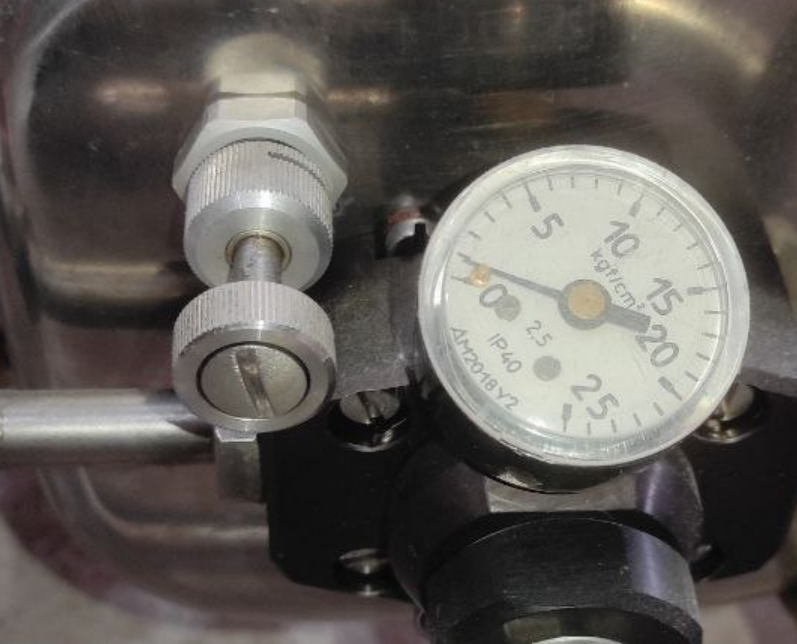

| Рисунок 7.7 а. Вид вентиля
| дежурной горелки и манометра.

   Для обеспечения пониженного уровня шума, дополнительного
   резервирования, а также для подсветки оболочки аэростата изнутри,
   основные горелки оснащены бесшумными горелками, которые
   включаются/выключаются при помощи соответствующего крана. Бесшумная
   горелка, представляет собой одну форсунку; топливо в ней не
   испаряется и истекает в жидком состоянии. Полнота сгорания топлива в
   бесшумной горелке ниже, чем в основной горелке, поэтому длительная
   работа в жидкостном режиме бесшумной горелкой не рекомендуется.
   Бесшумная горелка способна обеспечивать горизонтальный полет
   аэростата, однако ее тепловая мощность примерно в два раза ниже
   мощности основной горелки.

   .. image:: media/image12.jpg
      :width: 6.49549in
      :height: 4.08333in

   1 - Рычаг клапана бесшумной горелки, 2 – рычаг огневого клапана, 3 –
   перепускной кран.

   Рисунок 7.7 б Арматура горелки

   Манометры предназначены для контроля давления в баллонах, а также для
   косвенного контроля качества топлива. Малое давление при заданной
   температуре свидетельствует о большом содержании бутана и других
   газов с низким давлением насыщенных паров. Диапазон рабочего давления
   газа указан в разделе 2.9.

Баллоны
-------

   Баллоны служат для хранения и подачи пропан-бутановой смеси в
   горелки.

   В составе теплового аэростата используются баллоны типа «Стандарт».
   Колбы баллонов изготовлены из алюминиевого сплава. В верхней части
   обоих исполнений баллона установлен арматурный блок, включающий
   органы управления баллоном:

-  вентиль со штуцером, с расположенным внутри штуцера нажимным обратным
      клапаном. К нижней части арматурного блока присоединен
      трубопровод, забирающий жидкий газ со дна баллона. Обратный клапан
      предназначен для закрытия магистрали при отсоединении рукава
      жидкой фазы;

-  ниппель, используемый для контроля уровня заправки баллона. К нижней
      части ниппеля присоединена трубка, опущенная внутрь баллона на
      длину, соответствующую наполнению баллона на 80-85% его объема;

-  предохранительный клапан для защиты баллона от чрезмерного
      внутреннего давления;

-  указатель уровня топлива, указатель начинает показывать, когда
      уровень топлива опускается ниже 30%\ *.*

..

   На баллоны надеты чехлы, необходимые для предохранения от быстрого
   охлаждения при подъеме на большую высоту, а также от возможных ударов
   при транспортировке, установке и других работах.

   Внешний вид арматурных блоков баллонов показан на Рисунке 7.8.

+-----------------------------------------------------------------------+
| |image7|                                                              |
+=======================================================================+
| *Баллон типа «Стандарт»*                                              |
|                                                                       |
| *Выноски 1-3 не используются; 3 - ниппель контроля заправки; 4 -      |
| контрольное отверстие; 5 – указатель остатка топлива; 6 -             |
| предохранительный клапан; 7 - редуктор газовой фазы;.8 - штуцер       |
| (разъем) жидкой фазы с нажимным клапаном; 9 - запорный вентиль жидкой |
| фазы.*                                                                |
|                                                                       |
| Рисунок 7.8. Внешний вид арматурного блока баллонов                   |
+-----------------------------------------------------------------------+

7.6. Приборный блок
-------------------

   Владелец (эксплуатант) должен в полетах использовать электронное
   устройство, выполняющее функции высотомера и вариометра.

   Поскольку явно перечислить все устройства-аналоги на рынке в силу
   обширности их номенклатуры не представляется возможным ― подбор
   конкретной используемой модели возложен на владельца либо пилота.

   В большинстве случаев в качестве приборного блока на аэростатах
   используются цифровые вариометры для авиационных видов активности, в
   первую очередь для парапланеристов (Naviter и другие). В качестве
   примера подобного приборного блока приводится устройство IQONE
   Brauniger (Рисунок 7.9). В настоящее время производство данной модели
   прекращено, но выпускаются аналоги.

   Единственное требование к устройству, используемому в качестве
   обязательного приборного блока ― его исправное состояние и наличие в
   нем барометрического датчика атмосферного давления. На исправность
   устройства в целом, как и датчика конкретно, указывает успешное
   прохождение самотестирования при включении.

   В качестве приборного блока допускается применение мобильных
   телефонов при условии что они оснащены барометрическим датчиком
   атмосферного давления, а GNSS-приемник (GPS/Глонасс) принудительно
   отключен в настройках.

   В соответствие с эксплуатационной документацией в силу конструктивных
   особенностей выполнение дополнительных поверок электронных
   вариометров не требуется – калибровка проходит в режиме
   самотестирования при каждом включении. Эксплуатация, хранение и
   техническое обслуживание приборного блока производится в соответствие
   с инструкцией, входящей в состав блока.

   | 1 - кнопка включения и выключения, 2 - кнопка переключения
     измерителя высоты А1 и А2,
   | 3 - кнопка обнуления высоты А3,
   | 4 - кнопка включения хронометра,
   | 5 - кнопка выбора силы звука,
   | 6 - кнопка включения звукового сигнала скорости снижения,
   | 7 - индикация высоты А1 и А2,
   | 8 - индикация высоты А3,
   | 9 - индикация вертикальной скорости, 10 - индикация температуры,
   | 11 - часы,
   | 12 - индикатор заряда батареи. |image8|

Рисунок 7.9. Многофункциональный электронный приборный блок Brauniger
IQONE.

Запасной фал
------------

   Запасной фал предназначен для зачаливания аэростата после посадки (в
   случае необходимости), а также в других случаях.

Медицинская аптечка
-------------------

   В аэростате применяется автомобильная аптечка.

Огнетушитель
------------

   Применяется порошковый огнетушитель с массой огнегасящего
   состава 2кг.

Механизм отцепки и уздечка
--------------------------

   Механизм отцепки предназначен для предотвращения преждевременного
   старта аэростата, путем крепления его к стартовому фалу, и для
   отцепки аэростата перед взлетом. Уздечка предназначена для крепления
   замка отцепа к карабинам аэростата. Для ее крепления могут
   использоваться два дополнительных карабина.

+-----------------------------------------------------------------------+
| .. image:: media/image10.jpg                                          |
|    :width: 4.01964in                                                  |
|    :height: 1.97309in                                                 |
|                                                                       |
| 1- уздечка, 2 - механизм отцепки, 3 - рычаг, 4 - фиксатор, 5 - чека,  |
|                                                                       |
| 6 - поводок.                                                          |
|                                                                       |
|    Рисунок 7.10. Механизм отцепки                                     |
+-----------------------------------------------------------------------+

Другие составные части, применяемые в полете
--------------------------------------------

   В составе аэростата используются:

-  стойки для установки блока горелок на гондолу;

-  чехлы стоек для закрытия самих стоек, тросов гондолы и газовых
      рукавов блока горелок;

-  ремни крепления газовых баллонов;

-  сумка пилота.

   7. .. rubric:: Наземные составные части
         :name: наземные-составные-части

7.12.1. Вентилятор
~~~~~~~~~~~~~~~~~~

   Вентилятор (Рисунок 7.11) предназначен для предварительного
   наполнения оболочки холодным воздухом. Мощность вентилятора - 5 л.с.
   Можно применять любые вентиляторы, предназначенные для наполнения
   холодным воздухом оболочек тепловых аэростатов с учетом рекомендаций
   изготовителей.

  ..image: media/image3.jpg 
    Рис. 7.11. Вентилятор.                                             

7.12.2. Привязной фал
~~~~~~~~~~~~~~~~~~~~~

   Привязной фал (фалы)– капроновый (полиамидный) фал с разрывной
   нагрузкой и длиной, указанной в разделе 2.6, предназначен для
   зачаливания аэростата при подъеме аэростата на привязи.

7.12.3. Стартовый фал
~~~~~~~~~~~~~~~~~~~~~

   Стартовый фал - капроновый или лавсановый фал с разрывной нагрузкой
   не менее 3000 кгс, предназначен для крепления аэростата перед
   взлетом.

7.12.4. Технологический рукав
~~~~~~~~~~~~~~~~~~~~~~~~~~~~~

   Технологический рукав (Рисунок 7.12) совместно с переходниками
   предназначен для заправки газовых баллонов аэростата, стравливания
   газа из баллона и перелива газа из баллона в баллон.

  ..image: media/image7.jpg 
  
1 – накидная гайка для соединения с переходниками и с баллоном, из которого производится перелив газа; 2 – накидная гайка для подсоединения к баллону, в который производится заправка или перелив газа из другого баллона; 3 – заглушка.       
                         
Рисунок 7.12. Технологический рукав 

7.12.5. Переходники
~~~~~~~~~~~~~~~~~~~

   Переходники (Рисунок 7.13) совместно с технологическим рукавом
   позволяют осуществлять наполнение баллонов газом на автомобильных
   заправках, подключать аэростатный баллон к бытовому баллону.

+--------------------+--------------------+----------------------------+
| |7 Пререходники|   |                    |                            |
+====================+====================+============================+
| *a)*               | *b)*               | *c)*                       |
+--------------------+--------------------+----------------------------+
|    *a), b), - для  |                    |                            |
|    наполнения      |                    |                            |
|    баллонов на     |                    |                            |
|    автомобильных   |                    |                            |
|    заправках;      |                    |                            |
|    c) – для        |                    |                            |
|    соединения с    |                    |                            |
|    бытовым         |                    |                            |
|    баллоном.*      |                    |                            |
|                    |                    |                            |
|    Рисунок 7.13.   |                    |                            |
|    Переходники     |                    |                            |
+--------------------+--------------------+----------------------------+

Эксплуатация газовых баллонов
-----------------------------

Меры безопасности при работах с газовыми баллонами
--------------------------------------------------

   Эксплуатацию баллонов, их содержание в исправном состоянии,
   безопасные условия их работы и обслуживание проводить в соответствии
   с действующим руководством.

   ВНИМАНИЕ. НЕ ДОПУСКАЕТСЯ РАБОТА С НЕИСПРАВНЫМИ БАЛЛОНАМИ, А ТАКЖЕ С
   БАЛЛОНАМИ С ИСТЕКШИМ СРОКОМ ГОДНОСТИ, ЗА ИСКЛЮЧЕНИЕМ СЛИВА ГАЗА ПРИ
   ОБНАРУЖЕНИИ НЕГЕРМЕТИЧНОСТИ.

   ПРЕДУПРЕЖДЕНИЕ. НАХОЖДЕНИЕ БАЛЛОНОВ НЕ ДОПУСКАЕТСЯ ВБЛИЗИ ОТКРЫТОГО
   ОГНЯ, РАБОТАЮЩИХ ЭЛЕКТРОПРИБОРОВ И АВТОМОБИЛЕЙ, ВБЛИЗИ БАЛЛОНОВ
   ЗАПРЕЩАЕТСЯ КУРЕНИЕ. БАЛЛОНЫ НЕ ДОЛЖНЫ ПОДВЕРГАТЬСЯ ВОЗДЕЙСТВИЮ
   ПРЯМЫХ СОЛНЕЧНЫХ ЛУЧЕЙ ИЛИ НАХОДИТЬСЯ В НЕВЕНТИЛИРУЕМЫХ ЗАКРЫТЫХ
   ОБЪЕКТАХ.

   Обязательно наличие исправного огнетушителя.

   Обслуживающий персонал должен иметь одежду из неоплавляемой ткани,
   иметь на руках перчатки или рукавицы.

   ВНИМАНИЕ. НЕ ДОПУСКАЕТСЯ РАБОТА СТАЛЬНЫМИ ИЛИ ИНЫМИ ИНСТРУМЕНТАМИ,
   СПОСОБНЫМИ ВЫЗВАТЬ ПОЯВЛЕНИЕ ИСКРЫ.

   ПРЕДУПРЕЖДЕНИЕ. ЗАПРЕЩАЕТСЯ ЗАПРАВКА БАЛЛОНОВ БОЛЕЕ 85% ОБЩЕГО
   ОБЪЕМА. КОНТРОЛЬ ОСУЩЕСТВЛЯЕТСЯ ПО НАЧАЛУ ВЫХОДА ЖИДКОЙ ФАЗЫ ИЗ
   НИППЕЛЯ.

   В остальном, что не оговорено в настоящем разделе в части заправки,
   необходимо руководствоваться правилами, действующими на
   газонаполнительных станциях.

   Если баллон не подлежит дальнейшей эксплуатации в составе аэростата,
   он также непригоден для эксплуатации отдельно от аэростата.

Заправка баллонов
-----------------

   Газовые баллоны необходимо заправлять сжиженным нефтяным газом
   (пропан-бутановой смесью) для автомобилей или для бытовых целей по
   ГОСТ 27578-87 и ГОСТ Р 52087-2003 в России, или в соответствии с
   национальными правилами стран, где осуществляется эксплуатация
   аэростата.

   Заправка газовых баллонов должна производиться вне помещений на
   специально оборудованных станциях.

   Перед заправкой:

-  убедитесь в отсутствии повреждений корпуса баллона;

-  убедитесь на слух и по запаху в герметичности баллона;

-  убедитесь в наличии в нем остатка топлива путем кратковременного
      открытия ниппеля.

..

   ВНИМАНИЕ. БАЛЛОНЫ БЕЗ ОСТАТКА ГАЗА К ЗАПРАВКЕ БЕЗ ПРЕДВАРИТЕЛЬНОЙ
   ПРОВЕРКИ НА ГЕРМЕТИЧНОСТЬ НЕ ДОПУСКАЮТСЯ.

   Исключение составляют первая заправка новых баллонов, полученных с
   предприятия-изготовителя и заправка после полного опорожнения
   баллона, не связанного с его неисправностью.

   Наверните, на штуцер жидкой фазы заправляемого баллона накидную гайку
   2 технологического рукава. На переходник соответствующий рукаву
   наполнительной станции, наверните накидную гайку 1 и подсоедините
   переходник к рукаву наполнительной станции.

   Откройте ниппель контроля уровня заправки и вентиль баллона, а затем
   плавно откройте вентиль на рукаве наполнительной станции. Наполнение
   баллона продолжать до тех пор, пока из отверстия ниппеля не начнет
   брызгать жидкий газ. Как только из отверстия ниппеля начнет брызгать
   жидкий газ, закройте вентиль газового баллона и ниппель. Отсоедините
   рукав от заправленного баллона и подсоедините его к следующему
   баллону, требующему заправки. На заправленном баллоне стравите газ из
   полости клапана, для чего нажмите на нажимной клапан вентиля газового
   баллона любым тупым предметом. Аналогичным образом заправьте все
   баллоны. По окончанию заправки баллонов закройте кран на рукаве
   наполнительной станции и, соблюдая осторожность, отсоедините
   технологический рукав от рукава наполнительной станции.

   ВНИМАНИЕ. В МОМЕНТ ОТСОЕДИНЕНИЯ ТЕХНОЛОГИЧЕСКОГО РУКАВА ОТ РУКАВА
   НАПОЛНИТЕЛЬНОЙ СТАНЦИИ БУДЕТ СОПРОВОЖДАТЬСЯ ВЫХОДОМ ГАЗА, ОСТАВШЕГОСЯ
   В ТЕХНОЛОГИЧЕСКОМ РУКАВЕ. НЕОБХОДИМО СОБЛЮДАТЬ ОСТОРОЖНОСТЬ, ЧТОБЫ
   ЭТОТ ГАЗ НЕ ПОПАЛ В ГЛАЗА ИЛИ НА ОТКРЫТЫЕ УЧАСТКИ КОЖИ.

   ВНИМАНИЕ. ПОСЛЕ НАПОЛНЕНИЯ ОТРЕГУЛИРУЙТЕ УРОВЕНЬ ЗАПРАВКИ БАЛЛОНА,
   ДЛЯ ЧЕГО ОТКРОЙТЕ НИППЕЛЬ И СТРАВИТЕ ГАЗ ДО МОМЕНТА ПРЕКРАЩЕНИЯ
   ВЫХОДА ЖИДКОЙ ФАЗЫ; ПОСЛЕ ЧЕГО ЗАКРОЙТЕ НИППЕЛЬ.

Слив (перелив) газа из баллонов
-------------------------------

   Слив (перелив) газа из баллона производится в следующих случаях:

-  при транспортировании или хранении баллона в опорожненном состоянии,
      если того требуют правила транспортировки;

-  при нарушении герметичности газового баллона;

-  при проверке технического состояния;

-  при заправке или дозаправке других баллонов.

..

   Баллоны при сливе (переливе) должны быть установлены на заземленную
   поверхность.

   Слив газа может производиться методом дожига через блок горелок.

   ВНИМАНИЕ. СЛИВ (ПЕРЕЛИВ) ГАЗА СЛЕДУЕТ ПРОИЗВОДИТЬ НА ОТКРЫТОЙ, ХОРОШО
   ПРОДУВАЕМОЙ ПЛОЩАДКЕ. В ПРОЦЕССЕ РАБОТ РУКОВОДСТВОВАТЬСЯ ТРЕБОВАНИЯМИ
   МЕР БЕЗОПАСНОСТИ; КРОМЕ ЭТОГО, НЕОБХОДИМО, ЧТОБЫ С ПОДВЕТРЕННОЙ
   СТОРОНЫ НА РАССТОЯНИИ НЕ МЕНЕЕ 100М ПРИ ПЕРЕЛИВЕ И НЕ МЕНЕЕ 500М ПРИ
   СЛИВЕ НЕ БЫЛО ЛЮДЕЙ, СТРОЕНИЙ, ДОМАШНЕГО СКОТА, ЛИНИЙ ЭЛЕКТРО И
   ТЕЛЕГРАФНЫХ ПЕРЕДАЧ, АВТОМОБИЛЬНЫХ И ЖЕЛЕЗНОДОРОЖНЫХ МАГИСТРАЛЕЙ,
   КАКИХ-ЛИБО НЕ ПРОДУВАЕМЫХ УГЛУБЛЕНИЙ, СПОСОБНЫХ НАКАПЛИВАТЬ ГАЗ.

   При переливе газа из одного баллона в другой поставьте их рядом и
   соедините технологическим рукавом. На пустом баллоне откройте
   полностью ниппель. Откройте на обоих баллонах вентили. Контроль
   перетекания газа ведите по легкой вибрации рукава, прикоснувшись к
   нему рукой. Наполнение баллона продолжать до необходимого уровня, и
   перелив необходимо прекратить, как только из отверстия ниппеля начнет
   вытекать жидкий газ.

   При переливе из одного баллона в другой не допускайте перезаправку
   баллона.

   Допускается слив газа из баллона в атмосферу. В этом случае
   дополнительно убедитесь в выполнении мер безопасности (раздел 8.1).
   Установите баллон таким образом, чтобы штуцер был ориентирован по
   ветру. Минимальная скорость ветра при сливе газа из баллона в
   атмосферу - 3 м/с.

   ВНИМАНИЕ. СЛИВ ПРОИЗВОДИТЕ, ОТКРЫВАЯ ВЕНТИЛЬ БАЛЛОНА НА 3-5 СЕК. С
   ПЕРЕРЫВОМ НЕ МЕНЕЕ 15-20 СЕК.

8. .. rubric:: Допустимые повреждения и дефекты
      :name: допустимые-повреждения-и-дефекты-1

   1. .. rubric:: Общие требования
         :name: общие-требования

..

   В данном разделе перечислены повреждения и дефекты, с которыми
   тепловой аэростат может быть допущен к полетам, в том числе к
   подъемам на привязи.

   Любые повреждения и дефекты, выходящие за указанные ограничения,
   должны быть устранены в соответствии с Руководством по техническому
   обслуживанию.

   Приведенные допустимые повреждения рекомендуется отремонтировать в
   максимально короткий срок.

   Аэростат не допускается к полетам при:

-  повреждениях швов оболочки, вертикальных силовых лент и любых силовых
      элементов подвесной системы (тросов, карабинов);

-  негерметичности или отсутствии плавности в работе вентилей, клапанов
      топливной системы;

-  любых повреждениях топливных шлангов;

-  заеданиях фалов управления выпуска воздуха из оболочки;

-  повреждениях, выходящих за пределы допускаемых повреждений, указанных
      в данном разделе;

-  истекшем сроке проверки аэростата или его составных частей.

..

   ВНИМАНИЕ. ПРИ ВКЛЮЧЕНИИ В СОСТАВ АЭРОСТАТА СОСТАВНЫХ ЧАСТЕЙ СТОРОННИХ
   ИЗГОТОВИТЕЛЕЙ, ПО ДОПУСКАЕМЫМ ПОВРЕЖДЕНИЯМ И ДЕФЕКТАМ НЕОБХОДИМО
   РУКОВОДСТВОВАТЬСЯ УКАЗАНИЯМИ, НАХОДЯЩИМИСЯ В ЭКСПЛУАТАЦИОННЫХ
   ДОКУМЕНТАХ ЭТИХ СОСТАВНЫХ ЧАСТЕЙ И УКАЗАНИЯМИ НАСТОЯЩЕГО РАЗДЕЛА.

.. _оболочка-1:

Оболочка
--------

Допускаются следующие повреждения и дефекты:

-  повреждения на воздухозаборнике в виде отверстий или разрывов с
      максимальным линейным размером до 1 м общим количеством до 2-х;

-  повреждения ткани между входным отверстием до 5-ого снизу клина
      (включая юбку) в виде отверстий или разрывов с максимальным
      линейным размером от 0,5 м до 1 м и общим количеством не более
      2-х, или одно повреждение от 0,5 м до 1,5 м без повреждения
      вертикальных и горизонтальных швов;

-  повреждения ткани оболочки, расположенные выше области, указанной в
      предыдущем пункте, допускаются в виде отверстий или разрывов с
      максимальным линейным размером до 5 см. При этом расстояние между
      двумя соседними отверстиями должно быть более 10 см; общее
      количество повреждений должно быть не более 15 или не более 5 в
      пределах любого одного клина;

-  Потертости, нарушение покрытия поверхности купольного кольца
      оболочки. (Забоины, заусенцы, трещины, ржавчина и другие дефекты
      не допускаются);

-  Загрязнения нитей и потертости вертикальных силовых лент;

- Потертости, налет коррозии стальных тросов. (Не допускаются разрывы жил и изломы; 
заделка концов не должна иметь видимых повреждений).

Гондола
-------

Допускаются следующие повреждения и дефекты:

-  разрывы кожи на поручнях в верхней части гондолы с максимальными
      линейными размерами не более 10 см и общим количеством 5;

-  потертости поручней;

-  разрушения прутьев общим количеством 5 на каждой стороне или
      перегородке с расстоянием между этими отверстиями не менее 100мм и
      каждое площадью не более 25 см\ :sup:`2`;

-  износ и потертости деревянных брусков в нижней части гондолы на
      глубину не более 5 мм по всей длине.

   1. .. rubric:: Блок горелок
         :name: блок-горелок-1

Допускаются следующие повреждения и дефекты:

-  потертости и царапины на наружных частях блока горелок, кроме
      испарителя (змеевика), внутренних поверхностей присоединительных
      штуцеров и на резиновых шлангах рукавов;

-  деформации рамы блока горелок, не приводящие к ограничению
      перемещения горелки по углу установки, затруднению монтажа блока
      горелок, нарушению работоспособности;

-  наличие копоти на элементах блока горелок.

   1. .. rubric:: Газовые баллоны
         :name: газовые-баллоны

Допускаются следующие повреждения и дефекты:

-  вмятины глубиной не более 5мм и площадью не более 25 см\ :sup:`2`;

-  сколы лакокрасочного покрытия;

-  царапины глубиной до 0,4 мм;

-  деформации ограждения арматурного блока, если не ограничен доступ к
      вентилям и другим элементам, установленным на баллоне, не влияющие
      на работоспособность баллона;

-  деформация опоры баллона, не влияющая на устойчивость незакрепленного
      баллона;

-  несквозные повреждения защитного чехла.

   1. .. rubric:: Приборный блок
         :name: приборный-блок-1

Допускаются следующие повреждения и дефекты:

-  сколы лакокрасочного покрытия;

-  потертости и царапины на корпусе и стекле прибора;

-  повреждения, не влияющие на работоспособность самого приборного блока
      и возможность его крепления на аэростате.

   1. .. rubric:: Привязной, стартовый, запасной фалы, уздечка
         :name: привязной-стартовый-запасной-фалы-уздечка

..

   Допускаются потертости без повреждения силовых нитей.

Информация о техническом обслуживании и ремонте
-----------------------------------------------

   В целях поддержания летной годности на аэростате необходимо проводить
   техническое обслуживание с установленной периодичностью и сроками.
   Техническое обслуживание включает текущие ремонтные операции,
   разрешенные для выполнения эксплуатантом. Подробная информация о
   регламенте технического обслуживания аэростата и инструкции по его
   проведению приводятся в Руководстве по техническому обслуживанию и
   ремонту (АТ.РТО).

10. .. rubric:: Хранение и транспортировка
       :name: хранение-и-транспортировка

    1. .. rubric:: Хранение аэростата
          :name: хранение-аэростата

..

   Аэростат хранить в складских отапливаемых и неотапливаемых помещениях
   с температурой -20˚С - +30˚С и относительной влажностью до 80% без
   прямых осадков и конденсации влаги.

   Аэростат хранить как в состоянии, аналогичном поставке, так и
   отдельными составными частями.

   При хранении расстояние от наружных стен должно быть не менее 0,1 м,
   от отопительных приборов - не менее 0,5 м, для оболочки дополнительно
   от пола - не менее 0,1 м.

   Оболочка должна храниться только в сумке.

   Гондолу и баллоны (не заправленные) допускается устанавливать на пол;
   штабелирование не допускается.

   ВНИМАНИЕ. ПЕРЕД ХРАНЕНИЕМ ОБОЛОЧКУ, ЕСЛИ ОНА БЫЛА ВЛАЖНОЙ, СЛЕДУЕТ
   ПРОСУШИТЬ ПУТЕМ НАДДУВА ХОЛОДНЫМ ВОЗДУХОМ ДО ПОЛНОГО УСТРАНЕНИЯ
   СЛЕДОВ ВЛАГИ, С ПОСЛЕДУЮЩИМ ПРОГРЕВОМ БЛОКОМ ГОРЕЛОК.

   При хранении влажной оболочки возможно появление грибкового поражения
   ткани, способного уничтожить покрытие, обеспечивающее
   воздухопроницаемость ткани, и уменьшить прочность ткани.

   Гондола должна быть очищена от грязи и просушена.

   В процессе хранения должны быть исключены загрязнения, механические
   или иные повреждения аэростата и его составных частей.

   ВНИМАНИЕ. В СКЛАДСКИХ ПОМЕЩЕНИЯХ, ГДЕ ХРАНЯТСЯ АЭРОСТАТ И ЕГО
   СОСТАВНЫЕ ЧАСТИ, НЕ ДОПУСКАЕТСЯ ХРАНЕНИЕ ГОРЮЧЕ-СМАЗОЧНЫХ МАТЕРИАЛОВ,
   КИСЛОТ, ЩЕЛОЧЕЙ, ЛАКОКРАСОЧНЫХ МАТЕРИАЛОВ.

   ВНИМАНИЕ, НЕ ДОПУСКАЕТСЯ СОВМЕСТНОЕ ХРАНЕНИЕ ИСПРАВНЫХ И НЕИСПРАВНЫХ
   СОСТАВНЫХ ЧАСТЕЙ.

   Неисправные части должны быть помечены.

Хранение заправленных газовых баллонов
--------------------------------------

   Хранение баллонов должно проводиться в соответствии с "Правилами
   промышленной безопасности опасных производственных объектов, на
   которых используется оборудование, работающее под избыточным
   давлением", утвержденных приказом Ростехнадзора от 25.03.2014 № 116.

   Баллоны в заправленном состоянии должны храниться отдельно от других
   составных частей аэростата в хорошо проветриваемом помещении без
   источников воспламенения или чрезмерного нагрева.

   Баллоны не должны храниться вблизи подвалов или других не продуваемых
   углублений, где может собираться топливо.

   В странах, где данный приказ не действует - в соответствии с
   действующими нормативными документами по эксплуатации и хранению
   сосудов с огнеопасными газами, работающих под давлением.

Транспортировка
---------------

   Тепловой аэростат может транспортироваться любыми видами транспорта.

   При транспортировке аэростат должен находиться в разобранном виде.

   Оболочку допускается транспортировать только в сумке.

   Остальные составные части рекомендуется транспортировать внутри
   гондолы. Все составные части и оборудование должны быть закреплены и
   проложены материалом, исключающим возможность их повреждения и
   перемещения.

   На разъемы рукавов блока горелки и баллонов должны быть установлены
   заглушки.

   Блок горелок перевозить только со стравленным из системы топливом и
   отсоединенным от баллонов. При транспортировке блока горелок во
   избежание повреждения рукавов убедитесь в отсутствии их
   перекручивания и передавливания, которые могут привести к нарушению
   герметичности.

   При транспортировке газовых баллонов в составе гондолы они должны
   быть надежно закреплены и находиться в вертикальном положении.
   Условия и правила транспортировки газовых баллонов должны
   соответствовать правилам, действующим на соответствующем виде
   транспорта. При транспортировке автомобильным видом транспорта
   необходимо руководствоваться Европейским соглашением о международной
   дорожной перевозке опасных грузов (ДОГОП), а также национальными
   правилами.

   При транспортировке составных частей в незащищенном от осадков
   транспорте рекомендуется их закрыть защитным чехлом.

   Транспортировка аэростата морским транспортом на палубе вне
   контейнера не рекомендуется.

Приложения
----------

**Максимальная взлетная масса аэростата**

   В таблице все высоты указаны над уровнем моря. При использовании
   барометрического высотомера с целью определения высоты места старта
   его необходимо устанавливать по давлению, приведенному к уровню моря
   (QNH).

Максимальная взлетная масса аэростата объемом 2950 м\ :sup:`3`

+-------+------+------+------+-----+--------+-------+-------+------+
| В     |      |      |      |     | Плани  |       |       |      |
| ысота |      |      |      |     | руемая |       |       |      |
| места |      |      |      |     | высота |       |       |      |
| с     |      |      |      |     | полета |       |       |      |
| тарта |      |      |      |     | от     |       |       |      |
| от    |      |      |      |     | уровня |       |       |      |
| у     |      |      |      |     | моря   |       |       |      |
| ровня |      |      |      |     |        |       |       |      |
| моря  |      |      |      |     |        |       |       |      |
+=======+======+======+======+=====+========+=======+=======+======+
| 3000  | 2250 | 1500 | 750  | 0   | 0      | 1000  | 2000  | 3000 |
| м     | м    | м    | м    |     |        | м     | м     | м    |
+-------+------+------+------+-----+--------+-------+-------+------+
| Темп. |      |      |      |     | Максим |       |       |      |
|воздуха|      |      |      |     | альная |       |       |      |
|       |      |      |      |     |взлетная|       |       |      |
| у     |      |      |      |     |   масса|       |       |      |
| п     |      |      |      |     | [кг]   |       |       |      |
| оверх |      |      |      |     |        |       |       |      |
| ности |      |      |      |     |        |       |       |      |
| земли |      |      |      |     |        |       |       |      |
| [:s   |      |      |      |     |        |       |       |      |
| up:`о |      |      |      |     |        |       |       |      |
| `\ С] |      |      |      |     |        |       |       |      |
+-------+------+------+------+-----+--------+-------+-------+------+
|       |      |      |      | -20 | 975    |       |       |      |
+-------+------+------+------+-----+--------+-------+-------+------+
|       |      |      | -20  | -15 | 975    |       |       |      |
+-------+------+------+------+-----+--------+-------+-------+------+
|       |      | -20  | -15  | -10 | 975    | 975   |       |      |
+-------+------+------+------+-----+--------+-------+-------+------+
|       | -20  | -15  | -10  | -5  | 975    | 975   | 975   |      |
+-------+------+------+------+-----+--------+-------+-------+------+
| -20   | -15  | -10  | -5   | 0   | 975    | 975   | 966   | 927  |
+-------+------+------+------+-----+--------+-------+-------+------+
| -15   | -10  | -5   | 0    | 5   | 966    | 942   | 906   | 870  |
+-------+------+------+------+-----+--------+-------+-------+------+
| -10   | -5   | 0    | 5    | 10  | 903    | 879   | 849   | 816  |
+-------+------+------+------+-----+--------+-------+-------+------+
| -5    | 0    | 5    | 10   | 15  | 837    | 819   | 792   | 765  |
+-------+------+------+------+-----+--------+-------+-------+------+
| 0     | 5    | 10   | 15   | 20  | 774    | 759   | 738   | 714  |
+-------+------+------+------+-----+--------+-------+-------+------+
| 5     | 10   | 15   | 20   | 25  | 714    | 705   | 687   | 666  |
+-------+------+------+------+-----+--------+-------+-------+------+
| 10    | 15   | 20   | 25   | 30  | 654    | 648   | 636   | 621  |
+-------+------+------+------+-----+--------+-------+-------+------+
| 15    | 20   | 25   | 30   | 35  | 600    | 597   | 588   | 576  |
+-------+------+------+------+-----+--------+-------+-------+------+
| 20    | 25   | 30   | 35   | 40  | 543    | 543   | 540   | 531  |
+-------+------+------+------+-----+--------+-------+-------+------+

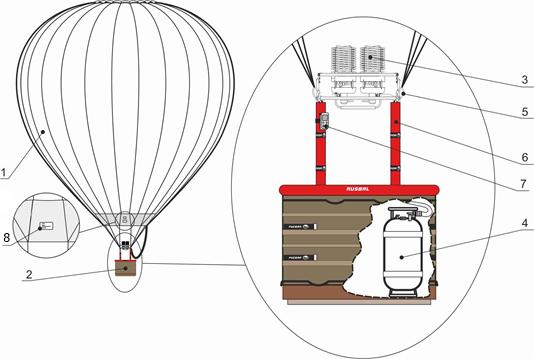
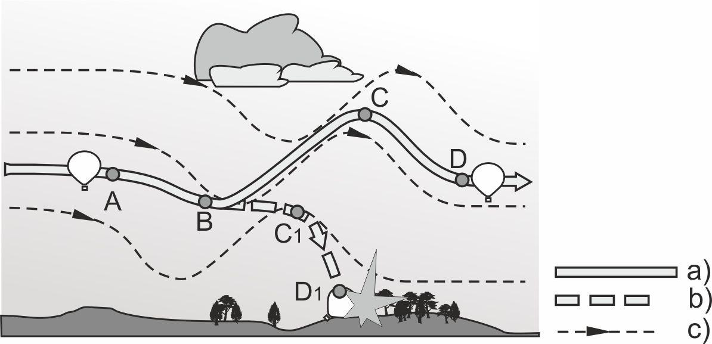
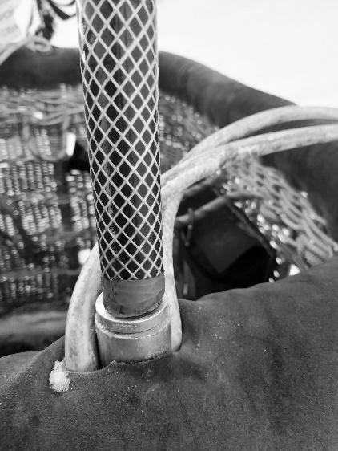
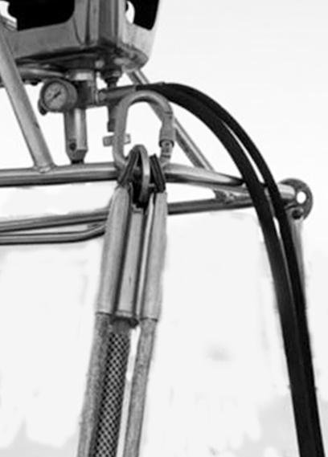
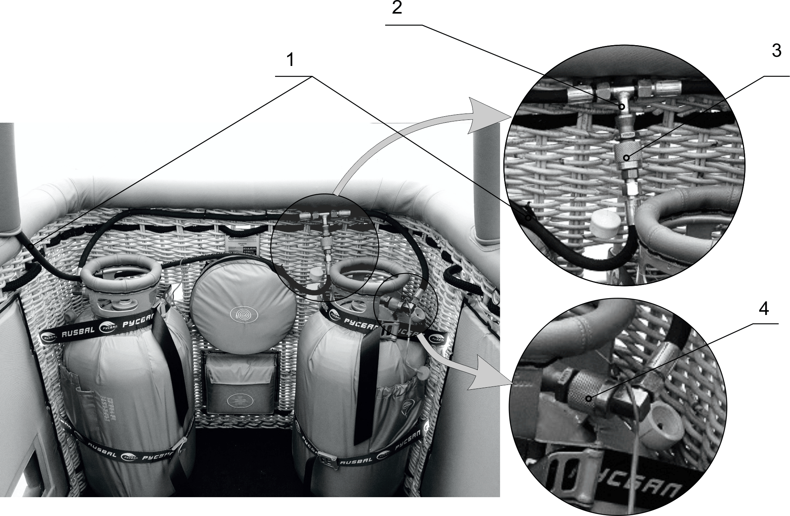
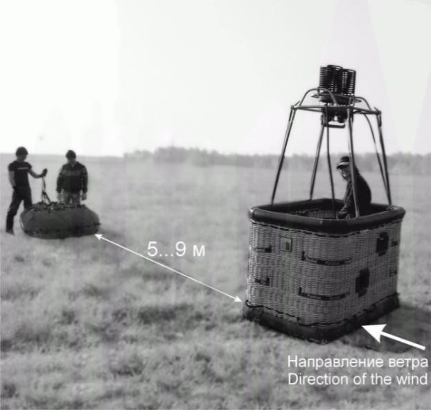
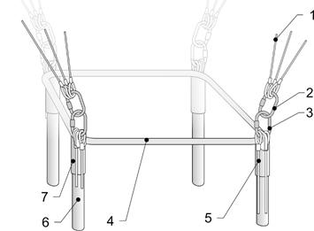
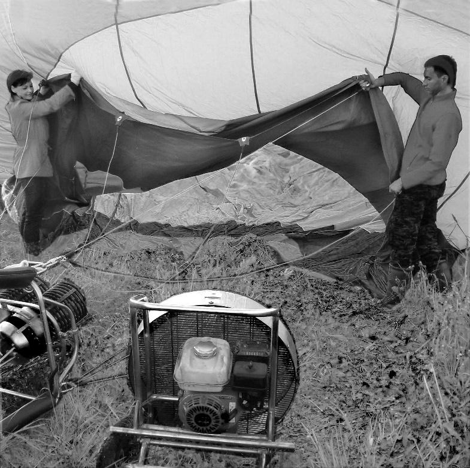
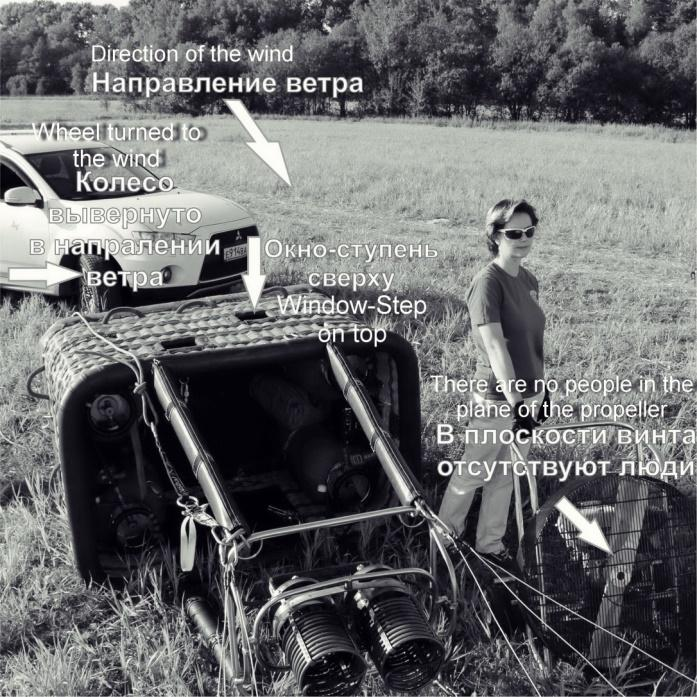
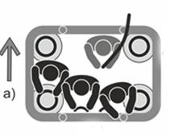
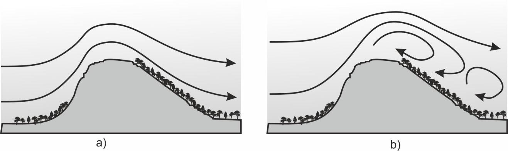
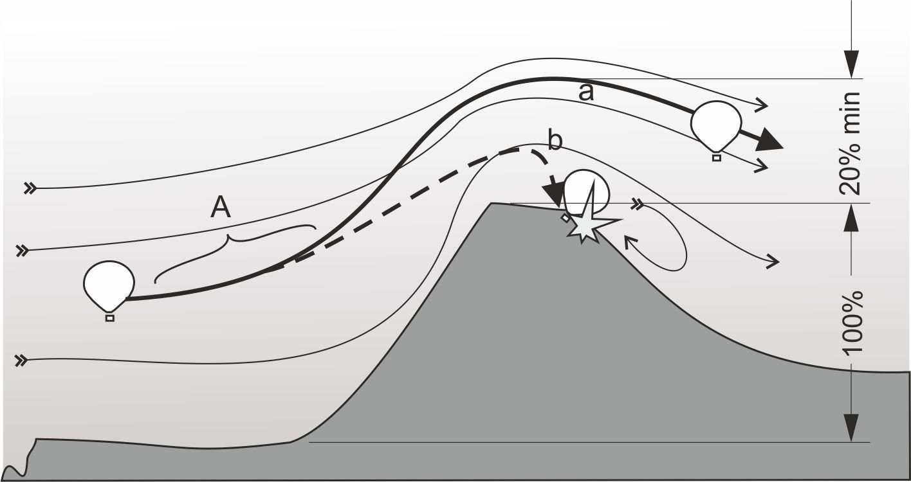
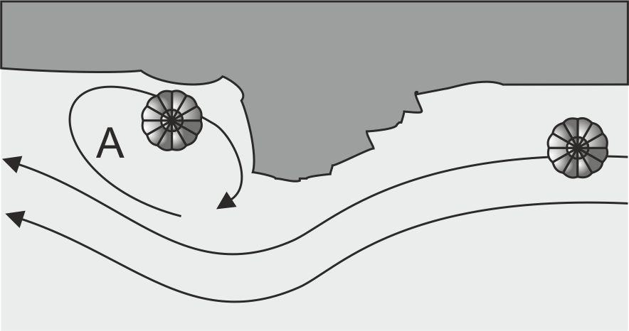
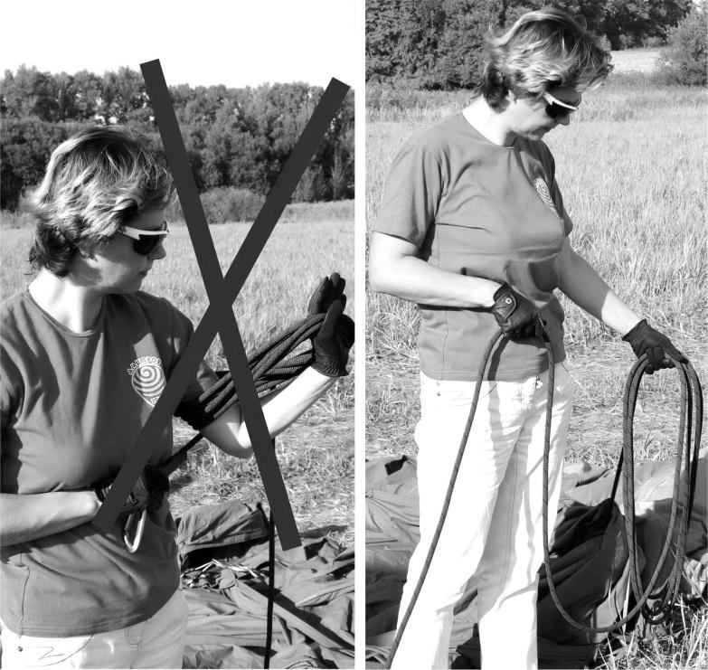
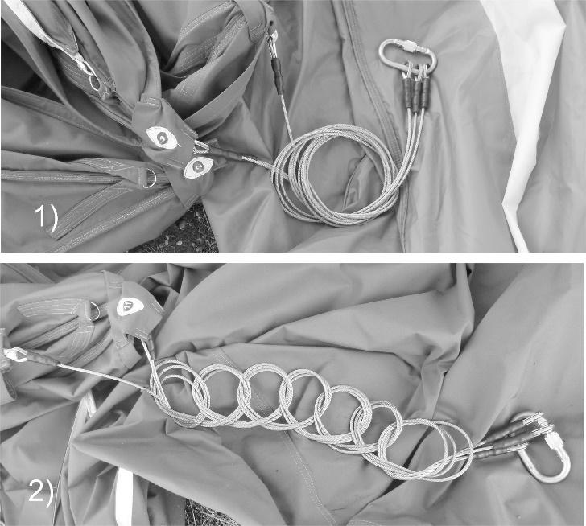
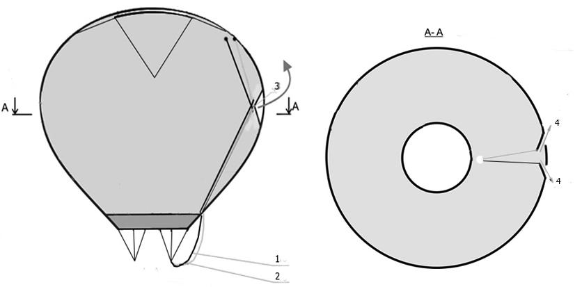
.. |image7| image:: media/image1.jpg
   :width: 3.78229in
   :height: 2.71183in
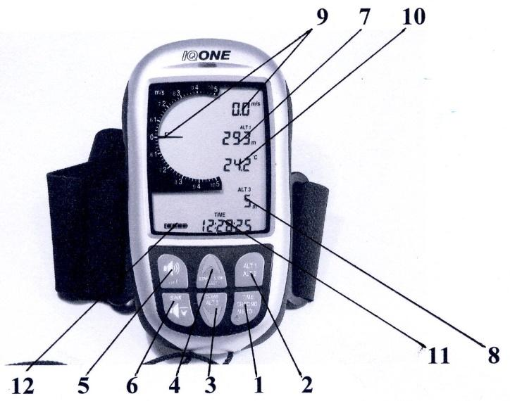
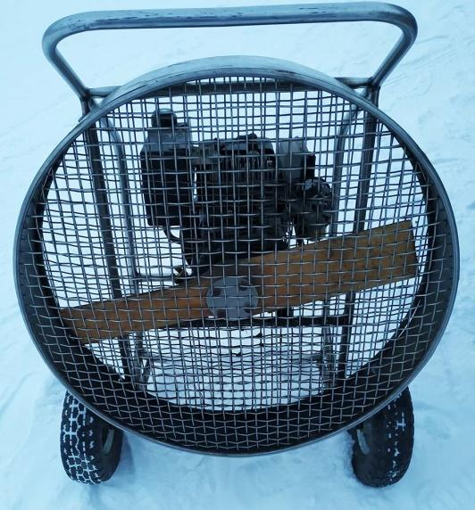
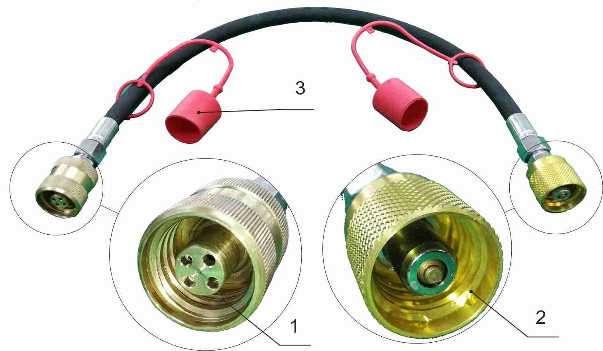
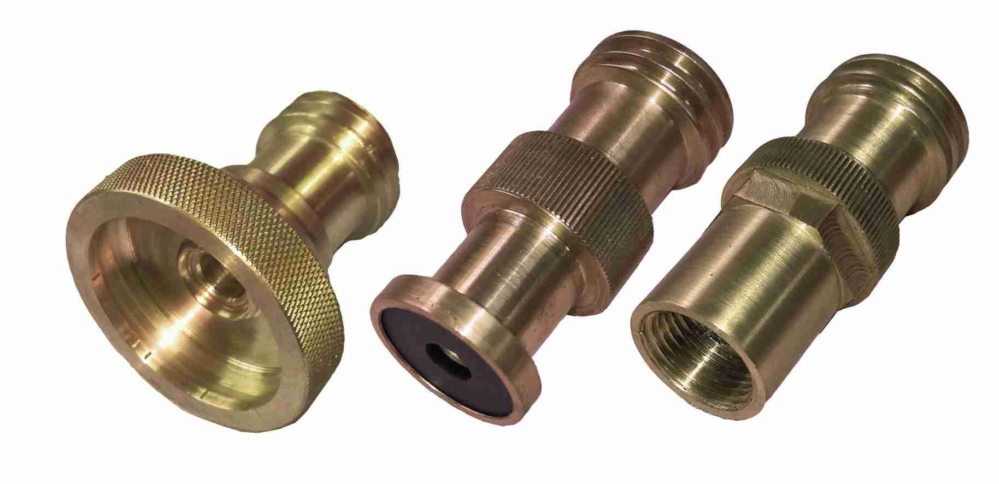
